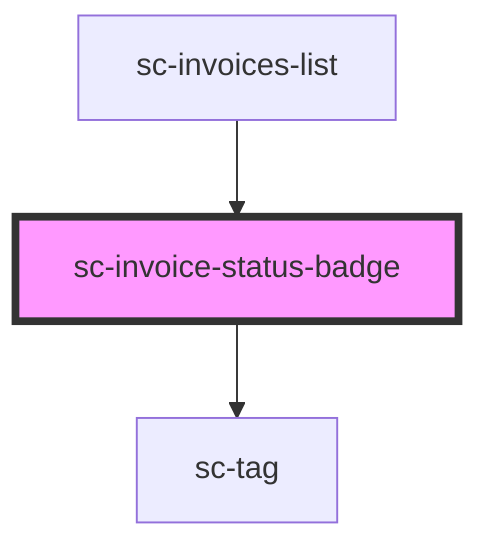

# sc-invoice-status-badge

<!-- Auto Generated Below -->

## Properties

| Property    | Attribute   | Description                                | Type                             | Default     |
| ----------- | ----------- | ------------------------------------------ | -------------------------------- | ----------- |
| `clearable` | `clearable` | Makes the tag clearable.                   | `boolean`                        | `false`     |
| `pill`      | `pill`      | Draws a pill-style tag with rounded edges. | `boolean`                        | `false`     |
| `size`      | `size`      | The tag's size.                            | `"large" \| "medium" \| "small"` | `'medium'`  |
| `status`    | `status`    | The tag's statux type.                     | `"draft" \| "open" \| "paid"`    | `undefined` |

## Dependencies

### Used by

 - [sc-invoices-list](../../controllers/dashboard/invoices-list)

### Depends on

- [sc-tag](../tag)

### Graph

----------------------------------------------

*Built with [StencilJS](https://stenciljs.com/)*
