# ce-line-item

<!-- Auto Generated Below -->

## Properties

| Property   | Attribute  | Description       | Type     | Default     |
| ---------- | ---------- | ----------------- | -------- | ----------- |
| `currency` | `currency` | Currency symbol   | `string` | `undefined` |
| `price`    | `price`    | Price of the item | `string` | `undefined` |

## Slots

| Slot                  | Description                              |
| --------------------- | ---------------------------------------- |
| `"currency"`          | Used for the 3 character currency code.  |
| `"description"`       | Line item description (below the title)  |
| `"image"`             | Line item image                          |
| `"price"`             | Price amount, including currency sign.   |
| `"price-description"` | Description for the price (i.e. monthly) |
| `"title"`             | Line item title.                         |

## Shadow Parts

| Part                  | Description                              |
| --------------------- | ---------------------------------------- |
| `"base"`              | The elements base wrapper.               |
| `"currency"`          | Used for the 3 character currency code.  |
| `"description"`       | Line item description (below the title)  |
| `"image"`             | The image wrapper.                       |
| `"price"`             | Price amount, including currency sign.   |
| `"price-description"` | Description for the price (i.e. monthly) |
| `"price-text"`        | The price text.                          |
| `"text"`              | The text.                                |
| `"title"`             | The title.                               |

## Dependencies

### Used by

 - [sc-coupon-form](../coupon-form)
 - [sc-line-item-bump](../../controllers/checkout-form/sc-line-item-bump)
 - [sc-line-item-invoice-due-date](../../controllers/checkout-form/invoice-due-date)
 - [sc-line-item-invoice-number](../../controllers/checkout-form/invoice-number)
 - [sc-line-item-invoice-receipt-download](../../controllers/checkout-form/invoice-receipt-download)
 - [sc-line-item-shipping](../../controllers/checkout-form/sc-line-item-shipping)
 - [sc-line-item-tax](../../controllers/checkout-form/line-item-tax)
 - [sc-line-item-total](../../controllers/checkout-form/line-item-total)
 - [sc-line-item-trial](../../controllers/checkout-form/line-item-trial)
 - [sc-line-items](../../controllers/checkout-form/line-items)
 - [sc-order](../../controllers/dashboard/order)
 - [sc-order-confirmation-details](../../controllers/confirmation/order-confirmation-details)
 - [sc-order-confirmation-line-items](../../controllers/confirmation/order-confirmation-line-items)
 - [sc-order-confirmation-totals](../../controllers/confirmation/order-confirmation-totals)
 - [sc-order-summary](../../controllers/checkout-form/order-summary)
 - [sc-subscription-next-payment](../../controllers/dashboard/subscription-details)
 - [sc-summary](../sc-summary)
 - [sc-upcoming-invoice](../../controllers/dashboard/upcoming-invoice)
 - [sc-upsell-totals](../../controllers/upsell/sc-upsell-totals)

### Graph

```mermaid
graph TD;
  sc-coupon-form --> sc-line-item
  sc-line-item-bump --> sc-line-item
  sc-line-item-invoice-due-date --> sc-line-item
  sc-line-item-invoice-number --> sc-line-item
  sc-line-item-invoice-receipt-download --> sc-line-item
  sc-line-item-shipping --> sc-line-item
  sc-line-item-tax --> sc-line-item
  sc-line-item-total --> sc-line-item
  sc-line-item-trial --> sc-line-item
  sc-line-items --> sc-line-item
  sc-order --> sc-line-item
  sc-order-confirmation-details --> sc-line-item
  sc-order-confirmation-line-items --> sc-line-item
  sc-order-confirmation-totals --> sc-line-item
  sc-order-summary --> sc-line-item
  sc-subscription-next-payment --> sc-line-item
  sc-summary --> sc-line-item
  sc-upcoming-invoice --> sc-line-item
  sc-upsell-totals --> sc-line-item
  style sc-line-item fill:#f9f,stroke:#333,stroke-width:4px
```

----------------------------------------------

*Built with [StencilJS](https://stenciljs.com/)*
