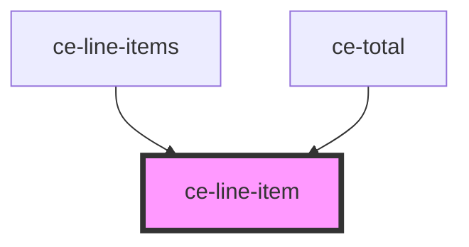

# ce-line-item

<!-- Auto Generated Below -->

## Properties

| Property   | Attribute  | Description       | Type     | Default     |
| ---------- | ---------- | ----------------- | -------- | ----------- |
| `currency` | `currency` | Currency symbol   | `string` | `undefined` |
| `price`    | `price`    | Price of the item | `string` | `undefined` |

## Slots

| Slot                  | Description                              |
| --------------------- | ---------------------------------------- |
| `"currency"`          | Used for the 3 character currency code.  |
| `"description"`       | Line item description (below the title)  |
| `"image"`             | Line item image                          |
| `"price"`             | Price amount, including currency sign.   |
| `"price-description"` | Description for the price (i.e. monthly) |
| `"title"`             | Line item title.                         |

## Shadow Parts

| Part      | Description |
| --------- | ----------- |
| `"base"`  |             |
| `"image"` |             |
| `"price"` |             |
| `"text"`  |             |

## Dependencies

### Used by

 - [ce-line-items](../../controllers/line-items)
 - [ce-total](../../controllers/total)

### Graph

----------------------------------------------

*Built with [StencilJS](https://stenciljs.com/)*
