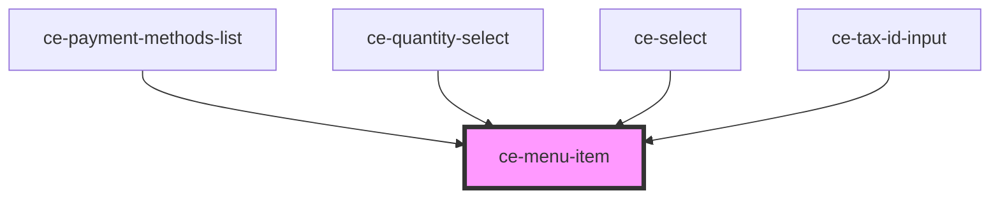

# ce-menu-item

<!-- Auto Generated Below -->

## Properties

| Property   | Attribute  | Description                                                                                               | Type      | Default     |
| ---------- | ---------- | --------------------------------------------------------------------------------------------------------- | --------- | ----------- |
| `checked`  | `checked`  | Draws the item in a checked state.                                                                        | `boolean` | `false`     |
| `disabled` | `disabled` | Draws the menu item in a disabled state.                                                                  | `boolean` | `false`     |
| `href`     | `href`     | Optional link to follow.                                                                                  | `string`  | `undefined` |
| `value`    | `value`    | A unique value to store in the menu item. This can be used as a way to identify menu items when selected. | `string`  | `''`        |

## Methods

### `setBlur() => Promise<void>`

Removes focus from the button.

#### Returns

Type: `Promise<void>`

### `setFocus(options?: FocusOptions) => Promise<void>`

Sets focus on the button.

#### Returns

Type: `Promise<void>`

## Shadow Parts

| Part             | Description |
| ---------------- | ----------- |
| `"base"`         |             |
| `"checked-icon"` |             |
| `"label"`        |             |
| `"prefix"`       |             |
| `"suffix"`       |             |

## Dependencies

### Used by

 - [ce-payment-methods-list](../../controllers/dashboard/payment-methods-list)
 - [ce-quantity-select](../quantity-select)
 - [ce-select](../select)
 - [ce-tax-id-input](../../controllers/tax-id-input)

### Graph

----------------------------------------------

*Built with [StencilJS](https://stenciljs.com/)*
