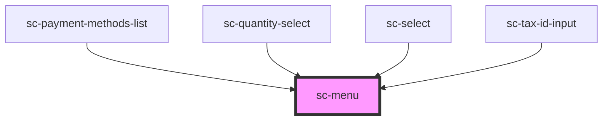

# ce-menu

<!-- Auto Generated Below -->

## Events

| Event      | Description | Type                                            |
| ---------- | ----------- | ----------------------------------------------- |
| `scSelect` |             | `CustomEvent<{ item: HTMLScMenuItemElement; }>` |

## Shadow Parts

| Part     | Description |
| -------- | ----------- |
| `"base"` |             |

## Dependencies

### Used by

 - [sc-payment-methods-list](../../controllers/dashboard/payment-methods-list)
 - [sc-quantity-select](../quantity-select)
 - [sc-select](../select)
 - [sc-tax-id-input](../tax-id-input)

### Graph

----------------------------------------------

*Built with [StencilJS](https://stenciljs.com/)*
