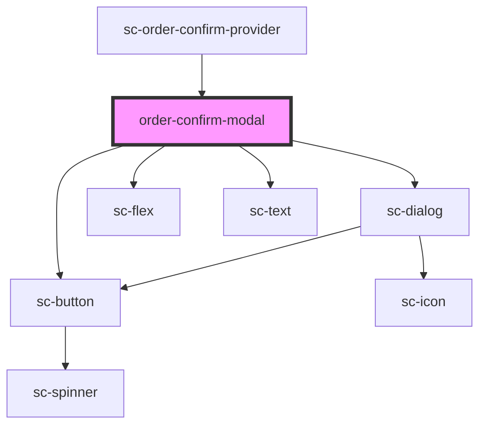

# order-confirm-modal

<!-- Auto Generated Below -->

## Properties

| Property     | Attribute     | Description           | Type      | Default |
| ------------ | ------------- | --------------------- | --------- | ------- |
| `open`       | `open`        | Whether modal is open | `boolean` | `false` |
| `successUrl` | `success-url` | The success url       | `string`  | `''`    |

## Dependencies

### Used by

 - [sc-order-confirm-provider](../../providers/order-confirm-provider)

### Depends on

- [sc-dialog](../sc-dialog)
- [sc-flex](../flex)
- [sc-text](../text)
- [sc-button](../button)

### Graph

----------------------------------------------

*Built with [StencilJS](https://stenciljs.com/)*
