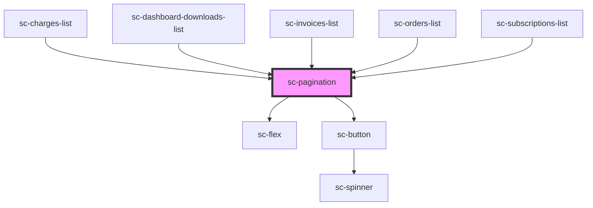

# ce-pagination

<!-- Auto Generated Below -->

## Properties

| Property       | Attribute       | Description | Type     | Default |
| -------------- | --------------- | ----------- | -------- | ------- |
| `page`         | `page`          |             | `number` | `1`     |
| `perPage`      | `per-page`      |             | `number` | `0`     |
| `total`        | `total`         |             | `number` | `0`     |
| `totalPages`   | `total-pages`   |             | `number` | `0`     |
| `totalShowing` | `total-showing` |             | `number` | `0`     |

## Events

| Event        | Description | Type                |
| ------------ | ----------- | ------------------- |
| `scNextPage` |             | `CustomEvent<void>` |
| `scPrevPage` |             | `CustomEvent<void>` |

## Dependencies

### Used by

 - [sc-charges-list](../../controllers/dashboard/charges-list)
 - [sc-dashboard-downloads-list](../../controllers/dashboard/dashboard-downloads-list)
 - [sc-invoices-list](../../controllers/dashboard/invoices-list)
 - [sc-orders-list](../../controllers/dashboard/orders-list)
 - [sc-subscriptions-list](../../controllers/dashboard/subscriptions-list)

### Depends on

- [sc-flex](../flex)
- [sc-button](../button)

### Graph

----------------------------------------------

*Built with [StencilJS](https://stenciljs.com/)*
