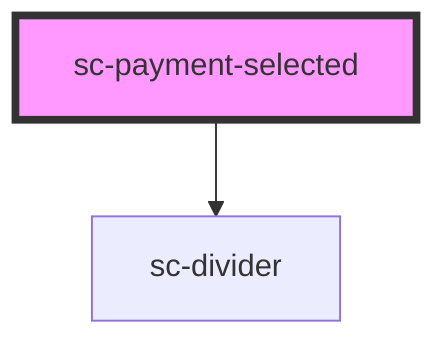

# sc-payment-selected

<!-- Auto Generated Below -->

## Properties

| Property   | Attribute   | Description | Type     | Default     |
| ---------- | ----------- | ----------- | -------- | ----------- |
| `iconName` | `icon-name` |             | `string` | `undefined` |
| `label`    | `label`     |             | `string` | `undefined` |

## Shadow Parts

| Part     | Description |
| -------- | ----------- |
| `"base"` |             |

## Dependencies

### Depends on

- [sc-divider](../divider)

### Graph

----------------------------------------------

*Built with [StencilJS](https://stenciljs.com/)*
