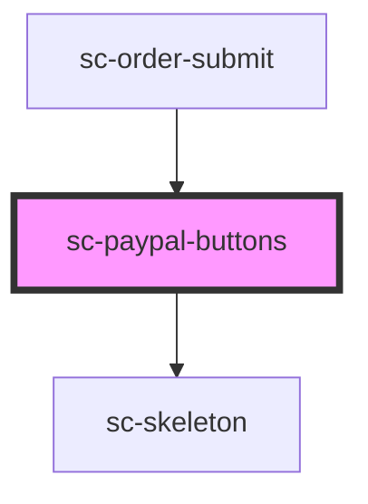

# sc-paypal-buttons

<!-- Auto Generated Below -->

## Properties

| Property     | Attribute     | Description                 | Type                                                           | Default              |
| ------------ | ------------- | --------------------------- | -------------------------------------------------------------- | -------------------- |
| `busy`       | `busy`        | Is this busy?               | `boolean`                                                      | `false`              |
| `buttons`    | --            | Buttons to render           | `string[]`                                                     | `['paypal', 'card']` |
| `clientId`   | `client-id`   | Client id for the script.   | `string`                                                       | `undefined`          |
| `color`      | `color`       | Button color.               | `"black" \| "blue" \| "gold" \| "silver" \| "white"`           | `'gold'`             |
| `label`      | `label`       | Label for the button.       | `"buynow" \| "checkout" \| "installment" \| "pay" \| "paypal"` | `'paypal'`           |
| `merchantId` | `merchant-id` | The merchant id for paypal. | `string`                                                       | `undefined`          |
| `mode`       | `mode`        | Test or live mode.          | `"live" \| "test"`                                             | `undefined`          |
| `order`      | --            | The order.                  | `Order`                                                        | `undefined`          |

## Events

| Event        | Description           | Type                  |
| ------------ | --------------------- | --------------------- |
| `scError`    | Emit an error         | `CustomEvent<object>` |
| `scPaid`     |                       | `CustomEvent<void>`   |
| `scSetState` | Set the state machine | `CustomEvent<string>` |

## Dependencies

### Used by

 - [sc-order-submit](../../controllers/checkout-form/order-submit)

### Depends on

- [sc-skeleton](../skeleton)

### Graph

----------------------------------------------

*Built with [StencilJS](https://stenciljs.com/)*
