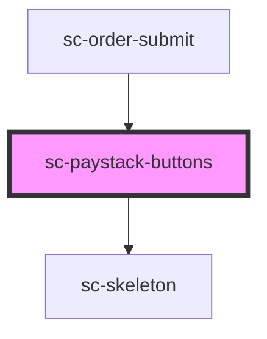

# sc-paystack-buttons

<!-- Auto Generated Below -->

## Properties

| Property    | Attribute    | Description                      | Type                                                             | Default                |
| ----------- | ------------ | -------------------------------- | ---------------------------------------------------------------- | ---------------------- |
| `accountId` | `account-id` | Account id of the merchant.      | `string`                                                         | `undefined`            |
| `busy`      | `busy`       | Is this busy?                    | `boolean`                                                        | `false`                |
| `buttons`   | --           | Buttons to render                | `string[]`                                                       | `['paystack', 'card']` |
| `color`     | `color`      | Button color.                    | `"black" \| "blue" \| "gold" \| "silver" \| "white"`             | `'gold'`               |
| `label`     | `label`      | Label for the button.            | `"buynow" \| "checkout" \| "installment" \| "pay" \| "paystack"` | `'paystack'`           |
| `mode`      | `mode`       | Test or live mode.               | `"live" \| "test"`                                               | `undefined`            |
| `order`     | --           | The order.                       | `Checkout`                                                       | `undefined`            |
| `publicKey` | `public-key` | The api public key for paystack. | `string`                                                         | `undefined`            |

## Events

| Event        | Description           | Type                  |
| ------------ | --------------------- | --------------------- |
| `scError`    | Emit an error         | `CustomEvent<object>` |
| `scPaid`     |                       | `CustomEvent<void>`   |
| `scSetState` | Set the state machine | `CustomEvent<string>` |

## Shadow Parts

| Part                     | Description |
| ------------------------ | ----------- |
| `"paystack-button"`      |             |
| `"paystack-card-button"` |             |

## Dependencies

### Used by

 - [sc-order-submit](../../controllers/checkout-form/order-submit)

### Depends on

- [sc-skeleton](../skeleton)

### Graph

----------------------------------------------

*Built with [StencilJS](https://stenciljs.com/)*
