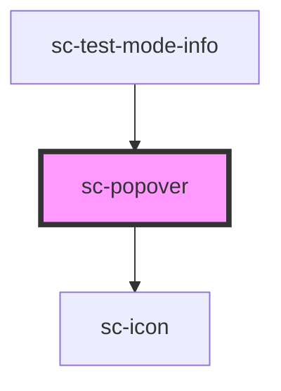

# sc-popover

<!-- Auto Generated Below -->

## Properties

| Property    | Attribute   | Description                                                                                                                               | Type                                                                                                                                                                 | Default          |
| ----------- | ----------- | ----------------------------------------------------------------------------------------------------------------------------------------- | -------------------------------------------------------------------------------------------------------------------------------------------------------------------- | ---------------- |
| `disabled`  | `disabled`  | Is this disabled.                                                                                                                         | `boolean`                                                                                                                                                            | `undefined`      |
| `distance`  | `distance`  | The distance in pixels from which to offset the panel away from its trigger.                                                              | `number`                                                                                                                                                             | `0`              |
| `hoist`     | `hoist`     | Enable this option to prevent the panel from being clipped when the component is placed inside a container with `overflow: auto\|scroll`. | `boolean`                                                                                                                                                            | `false`          |
| `open`      | `open`      | Indicates whether or not the popover is open. You can use this in lieu of the show/hide methods.                                          | `boolean`                                                                                                                                                            | `false`          |
| `placement` | `placement` | The placement of the popover.                                                                                                             | `"bottom" \| "bottom-end" \| "bottom-start" \| "left" \| "left-end" \| "left-start" \| "right" \| "right-end" \| "right-start" \| "top" \| "top-end" \| "top-start"` | `'bottom-start'` |
| `skidding`  | `skidding`  | The distance in pixels from which to offset the panel along its trigger.                                                                  | `number`                                                                                                                                                             | `0`              |

## Events

| Event    | Description                                                                                          | Type                |
| -------- | ---------------------------------------------------------------------------------------------------- | ------------------- |
| `scHide` | Emitted when the popover closes. Calling `event.preventDefault()` will prevent it from being closed. | `CustomEvent<void>` |
| `scShow` | Emitted when the popover opens. Calling `event.preventDefault()` will prevent it from being opened.  | `CustomEvent<void>` |

## Shadow Parts

| Part        | Description                |
| ----------- | -------------------------- |
| `"base"`    | The elements base wrapper. |
| `"panel"`   | The panel.                 |
| `"trigger"` | The trigger.               |

## Dependencies

### Used by

 - [sc-test-mode-info](../test-mode-info)

### Depends on

- [sc-icon](../icon)

### Graph

----------------------------------------------

*Built with [StencilJS](https://stenciljs.com/)*
