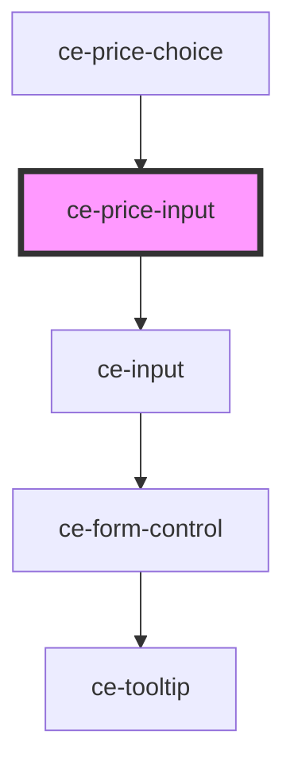

# ce-price-input

<!-- Auto Generated Below -->

## Properties

| Property       | Attribute       | Description                                                                                                                                                                                                   | Type                             | Default     |
| -------------- | --------------- | ------------------------------------------------------------------------------------------------------------------------------------------------------------------------------------------------------------- | -------------------------------- | ----------- |
| `autofocus`    | `autofocus`     | The input's autofocus attribute.                                                                                                                                                                              | `boolean`                        | `undefined` |
| `clearable`    | `clearable`     | Adds a clear button when the input is populated.                                                                                                                                                              | `boolean`                        | `false`     |
| `currencyCode` | `currency-code` | 3 letter currency code for input                                                                                                                                                                              | `string`                         | `undefined` |
| `disabled`     | `disabled`      | Disables the input.                                                                                                                                                                                           | `boolean`                        | `false`     |
| `hasFocus`     | `has-focus`     | Inputs focus                                                                                                                                                                                                  | `boolean`                        | `undefined` |
| `help`         | `help`          | The input's help text.                                                                                                                                                                                        | `string`                         | `''`        |
| `invalid`      | `invalid`       | This will be true when the control is in an invalid state. Validity is determined by props such as `type`, `required`, `minlength`, `maxlength`, and `pattern` using the browser's constraint validation API. | `boolean`                        | `false`     |
| `label`        | `label`         | The input's label.                                                                                                                                                                                            | `string`                         | `undefined` |
| `max`          | `max`           | The input's maximum value.                                                                                                                                                                                    | `number \| string`               | `undefined` |
| `maxlength`    | `maxlength`     | The maximum length of input that will be considered valid.                                                                                                                                                    | `number`                         | `undefined` |
| `min`          | `min`           | The input's minimum value.                                                                                                                                                                                    | `number \| string`               | `undefined` |
| `minlength`    | `minlength`     | The minimum length of input that will be considered valid.                                                                                                                                                    | `number`                         | `undefined` |
| `name`         | `name`          | The input's name attribute.                                                                                                                                                                                   | `string`                         | `undefined` |
| `pill`         | `pill`          | Draws a pill-style input with rounded edges.                                                                                                                                                                  | `boolean`                        | `false`     |
| `placeholder`  | `placeholder`   | The input's placeholder text.                                                                                                                                                                                 | `string`                         | `undefined` |
| `readonly`     | `readonly`      | Makes the input readonly.                                                                                                                                                                                     | `boolean`                        | `false`     |
| `required`     | `required`      | Makes the input a required field.                                                                                                                                                                             | `boolean`                        | `false`     |
| `showLabel`    | `show-label`    | Should we show the label                                                                                                                                                                                      | `boolean`                        | `true`      |
| `size`         | `size`          | The input's size.                                                                                                                                                                                             | `"large" \| "medium" \| "small"` | `'medium'`  |
| `value`        | `value`         | The input's value attribute.                                                                                                                                                                                  | `string`                         | `''`        |

## Events

| Event      | Description                               | Type                |
| ---------- | ----------------------------------------- | ------------------- |
| `ceChange` | Emitted when the control's value changes. | `CustomEvent<void>` |

## Methods

### `reportValidity() => Promise<boolean>`

#### Returns

Type: `Promise<boolean>`

### `setCustomValidity(message: string) => Promise<void>`

Sets a custom validation message. If `message` is not empty, the field will be considered invalid.

#### Returns

Type: `Promise<void>`

### `triggerBlur() => Promise<void>`

Removes focus from the input.

#### Returns

Type: `Promise<void>`

### `triggerFocus(options?: FocusOptions) => Promise<void>`

Sets focus on the input.

#### Returns

Type: `Promise<void>`

## Shadow Parts

| Part          | Description                                      |
| ------------- | ------------------------------------------------ |
| `"base"`      | The elements base wrapper.                       |
| `"help-text"` | Help text that describes how to use the input.   |
| `"input"`     | The html input element.                          |
| `"prefix"`    | Used to prepend an icon or element to the input. |
| `"suffix"`    | Used to prepend an icon or element to the input. |

## Dependencies

### Used by

 - [ce-price-choice](../../controllers/price-choice)

### Depends on

- [ce-input](../input)

### Graph

----------------------------------------------

*Built with [StencilJS](https://stenciljs.com/)*
