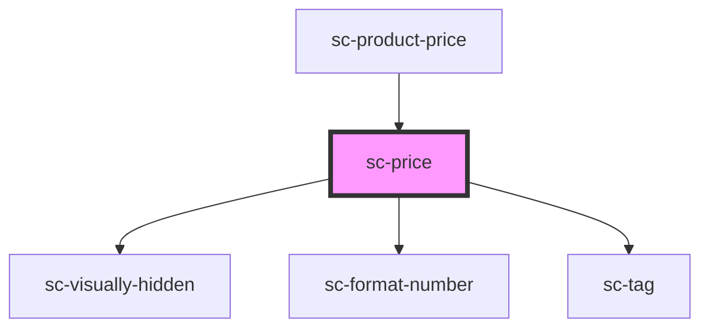

# sc-price

<!-- Auto Generated Below -->

## Overview

Internal dependencies.

## Properties

| Property                 | Attribute                  | Description                  | Type                                     | Default     |
| ------------------------ | -------------------------- | ---------------------------- | ---------------------------------------- | ----------- |
| `adHoc`                  | `ad-hoc`                   | Is the product ad_hoc?       | `boolean`                                | `undefined` |
| `amount`                 | `amount`                   | The amount                   | `number`                                 | `undefined` |
| `currency`               | `currency`                 | The currency.                | `string`                                 | `undefined` |
| `displayAmount`          | `display-amount`           | The display amount           | `string`                                 | `undefined` |
| `recurringInterval`      | `recurring-interval`       | The recurring interval       | `"month" \| "never" \| "week" \| "year"` | `undefined` |
| `recurringIntervalCount` | `recurring-interval-count` | The recurring interval count | `number`                                 | `undefined` |
| `recurringPeriodCount`   | `recurring-period-count`   | The recurring period count   | `number`                                 | `undefined` |
| `saleText`               | `sale-text`                | The sale text                | `string`                                 | `undefined` |
| `scratchAmount`          | `scratch-amount`           | The scratch amount           | `number`                                 | `undefined` |
| `scratchDisplayAmount`   | `scratch-display-amount`   | The scratch display amount   | `string`                                 | `undefined` |
| `setupFeeAmount`         | `setup-fee-amount`         | The setup fee amount         | `number`                                 | `undefined` |
| `setupFeeName`           | `setup-fee-name`           | The setup fee name           | `string`                                 | `undefined` |
| `setupFeeText`           | `setup-fee-text`           | The setup fee text           | `string`                                 | `undefined` |
| `trialDurationDays`      | `trial-duration-days`      | The trial duration days      | `number`                                 | `undefined` |

## Shadow Parts

| Part               | Description |
| ------------------ | ----------- |
| `"price__scratch"` |             |

## Dependencies

### Used by

 - [sc-product-price](../../controllers/product/sc-product-price)

### Depends on

- [sc-visually-hidden](../../util/visually-hidden)
- [sc-format-number](../../util/format-number)
- [sc-tag](../tag)

### Graph

----------------------------------------------

*Built with [StencilJS](https://stenciljs.com/)*
