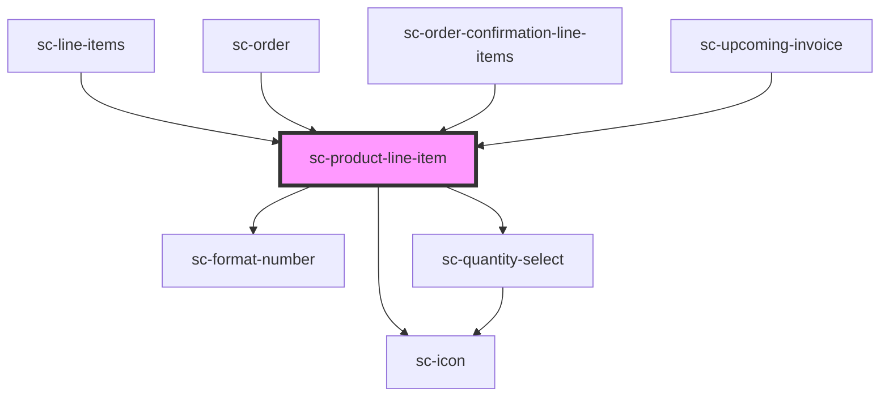

# ce-product-line-item

<!-- Auto Generated Below -->

## Properties

| Property            | Attribute             | Description                                   | Type      | Default     |
| ------------------- | --------------------- | --------------------------------------------- | --------- | ----------- |
| `amount`            | `amount`              | Product monetary amount                       | `number`  | `undefined` |
| `currency`          | `currency`            | Currency for the product                      | `string`  | `undefined` |
| `editable`          | `editable`            | Can we select the quantity                    | `boolean` | `true`      |
| `imageUrl`          | `image-url`           | Url for the product image                     | `string`  | `undefined` |
| `interval`          | `interval`            | Recurring interval (i.e. monthly, once, etc.) | `string`  | `undefined` |
| `max`               | `max`                 | The max allowed.                              | `number`  | `100`       |
| `name`              | `name`                | Product name                                  | `string`  | `undefined` |
| `quantity`          | `quantity`            | Quantity                                      | `number`  | `undefined` |
| `removable`         | `removable`           | Is the line item removable                    | `boolean` | `undefined` |
| `trialDurationDays` | `trial-duration-days` | Trial duration days                           | `number`  | `undefined` |

## Events

| Event              | Description                        | Type                  |
| ------------------ | ---------------------------------- | --------------------- |
| `scRemove`         | Emitted when the quantity changes. | `CustomEvent<void>`   |
| `scUpdateQuantity` | Emitted when the quantity changes. | `CustomEvent<number>` |

## Shadow Parts

| Part                   | Description                        |
| ---------------------- | ---------------------------------- |
| `"base"`               | The elements base wrapper.         |
| `"image"`              |                                    |
| `"input"`              | The input control.                 |
| `"minus"`              | The minus control.                 |
| `"minus-icon"`         | The minus icon.                    |
| `"plus"`               | The plus control.                  |
| `"plus-icon"`          | The plus icon.                     |
| `"price"`              | The price wrapper.                 |
| `"price__amount"`      | The price amount.                  |
| `"price__description"` | The price description.             |
| `"quantity__base"`     | The quantity base wrapper.         |
| `"remove-icon__base"`  | The remove icon base wrapper.      |
| `"static-quantity"`    | The statically displayed quantity. |
| `"suffix"`             | The suffix items.                  |
| `"text"`               | The text wrapper.                  |
| `"title"`              | The product title.                 |

## Dependencies

### Used by

 - [sc-line-items](../../controllers/checkout-form/line-items)
 - [sc-order](../../controllers/dashboard/order)
 - [sc-order-confirmation-line-items](../../controllers/confirmation/order-confirmation-line-items)
 - [sc-upcoming-invoice](../../controllers/dashboard/upcoming-invoice)

### Depends on

- [sc-format-number](../../util/format-number)
- [sc-quantity-select](../quantity-select)
- [sc-icon](../icon)

### Graph

----------------------------------------------

*Built with [StencilJS](https://stenciljs.com/)*
