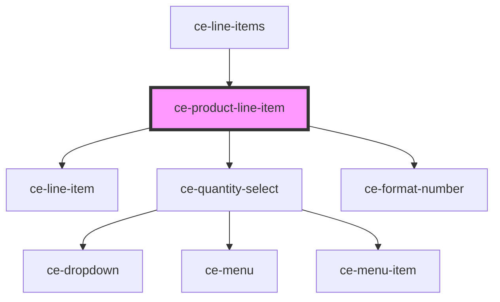

# ce-product-line-item

<!-- Auto Generated Below -->

## Properties

| Property    | Attribute   | Description                                   | Type      | Default     |
| ----------- | ----------- | --------------------------------------------- | --------- | ----------- |
| `amount`    | `amount`    | Product monetary amount                       | `number`  | `undefined` |
| `currency`  | `currency`  | Currency for the product                      | `string`  | `undefined` |
| `editable`  | `editable`  | Can we select the quantity                    | `boolean` | `true`      |
| `imageUrl`  | `image-url` | Url for the product image                     | `string`  | `undefined` |
| `interval`  | `interval`  | Recurring interval (i.e. monthly, once, etc.) | `string`  | `undefined` |
| `name`      | `name`      | Product name                                  | `string`  | `undefined` |
| `quantity`  | `quantity`  | Quantity                                      | `number`  | `undefined` |
| `removable` | `removable` | Is the line item removable                    | `boolean` | `undefined` |

## Events

| Event              | Description                        | Type                  |
| ------------------ | ---------------------------------- | --------------------- |
| `ceRemove`         | Emitted when the quantity changes. | `CustomEvent<void>`   |
| `ceUpdateQuantity` | Emitted when the quantity changes. | `CustomEvent<number>` |

## Dependencies

### Used by

 - [ce-line-items](../../controllers/line-items)

### Depends on

- [ce-line-item](../line-item)
- [ce-quantity-select](../quantity-select)
- [ce-format-number](../../util/format-number)

### Graph

----------------------------------------------

*Built with [StencilJS](https://stenciljs.com/)*
