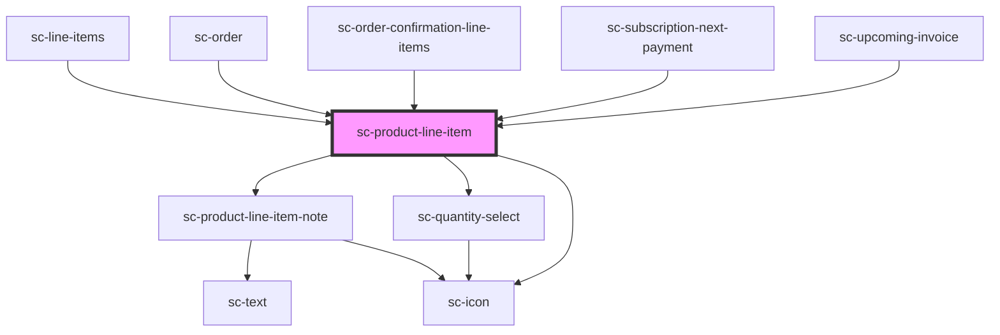

# ce-product-line-item

<!-- Auto Generated Below -->

## Properties

| Property               | Attribute                | Description                                   | Type              | Default     |
| ---------------------- | ------------------------ | --------------------------------------------- | ----------------- | ----------- |
| `amount`               | `amount`                 | Product monetary amount                       | `string`          | `undefined` |
| `displayAmount`        | `display-amount`         | Product display amount                        | `string`          | `undefined` |
| `editable`             | `editable`               | Can we select the quantity                    | `boolean`         | `true`      |
| `fees`                 | --                       | Product line item fees.                       | `Fee[]`           | `undefined` |
| `image`                | --                       | Image attributes.                             | `ImageAttributes` | `undefined` |
| `interval`             | `interval`               | Recurring interval (i.e. monthly, once, etc.) | `string`          | `undefined` |
| `max`                  | `max`                    | The max allowed.                              | `number`          | `undefined` |
| `name`                 | `name`                   | Product name                                  | `string`          | `undefined` |
| `note`                 | `note`                   | The line item note                            | `string`          | `undefined` |
| `price`                | `price`                  | Price name                                    | `string`          | `undefined` |
| `purchasableStatus`    | `purchasable-status`     | The purchasable status display                | `string`          | `undefined` |
| `quantity`             | `quantity`               | Quantity                                      | `number`          | `undefined` |
| `removable`            | `removable`              | Is the line item removable                    | `boolean`         | `undefined` |
| `scratch`              | `scratch`                | The line item scratch amount                  | `string`          | `undefined` |
| `scratchDisplayAmount` | `scratch-display-amount` | Product scratch display amount                | `string`          | `undefined` |
| `sku`                  | `sku`                    | The SKU.                                      | `string`          | `''`        |
| `trial`                | `trial`                  | Trial text                                    | `string`          | `undefined` |
| `variant`              | `variant`                | Product variant label                         | `string`          | `''`        |

## Events

| Event              | Description                        | Type                  |
| ------------------ | ---------------------------------- | --------------------- |
| `scRemove`         | Emitted when the quantity changes. | `CustomEvent<void>`   |
| `scUpdateQuantity` | Emitted when the quantity changes. | `CustomEvent<number>` |

## Shadow Parts

| Part                             | Description                     |
| -------------------------------- | ------------------------------- |
| `"base"`                         | The component base              |
| `"description"`                  |                                 |
| `"image"`                        | The product image               |
| `"line-item__price-description"` | The line item price description |
| `"placeholder__image"`           |                                 |
| `"price"`                        | The product price               |
| `"price__amount"`                | The product price amount        |
| `"price__description"`           | The product price description   |
| `"price__scratch"`               | The product price scratch       |
| `"product-line-item"`            | The product line item           |
| `"quantity"`                     | The product quantity            |
| `"quantity__input"`              | The product quantity input      |
| `"quantity__minus"`              | The product quantity minus      |
| `"quantity__minus-icon"`         | The product quantity minus icon |
| `"quantity__plus"`               | The product quantity plus       |
| `"quantity__plus-icon"`          | The product quantity plus icon  |
| `"remove-icon__base"`            | The product remove icon         |
| `"static-quantity"`              | The product static quantity     |
| `"suffix"`                       | The product suffix              |
| `"text"`                         | The product text                |
| `"title"`                        | The product title               |
| `"trial-fees"`                   |                                 |

## Dependencies

### Used by

 - [sc-line-items](../../controllers/checkout-form/line-items)
 - [sc-order](../../controllers/dashboard/order)
 - [sc-order-confirmation-line-items](../../controllers/confirmation/order-confirmation-line-items)
 - [sc-subscription-next-payment](../../controllers/dashboard/subscription-details)
 - [sc-upcoming-invoice](../../controllers/dashboard/upcoming-invoice)

### Depends on

- [sc-product-line-item-note](../product-line-item-note)
- [sc-quantity-select](../quantity-select)
- [sc-icon](../icon)

### Graph

----------------------------------------------

*Built with [StencilJS](https://stenciljs.com/)*
