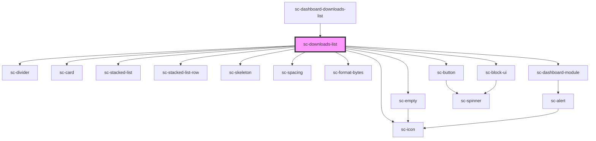

# ce-customer-subscriptions-list

<!-- Auto Generated Below -->

## Properties

| Property       | Attribute       | Description | Type         | Default     |
| -------------- | --------------- | ----------- | ------------ | ----------- |
| `allLink`      | `all-link`      |             | `string`     | `undefined` |
| `busy`         | `busy`          |             | `boolean`    | `undefined` |
| `error`        | `error`         |             | `string`     | `undefined` |
| `heading`      | `heading`       |             | `string`     | `undefined` |
| `loading`      | `loading`       |             | `boolean`    | `undefined` |
| `purchases`    | --              |             | `Purchase[]` | `[]`        |
| `requestNonce` | `request-nonce` |             | `string`     | `undefined` |

## Dependencies

### Used by

 - [sc-dashboard-downloads-list](../../controllers/dashboard/dashboard-downloads-list)

### Depends on

- [sc-divider](../divider)
- [sc-empty](../empty)
- [sc-card](../card)
- [sc-stacked-list](../stacked-list)
- [sc-stacked-list-row](../stacked-list-row)
- [sc-skeleton](../skeleton)
- [sc-spacing](../spacing)
- [sc-format-bytes](../../util/format-bytes)
- [sc-icon](../icon)
- [sc-dashboard-module](../dashboard-module)
- [sc-button](../button)
- [sc-block-ui](../block-ui)

### Graph

----------------------------------------------

*Built with [StencilJS](https://stenciljs.com/)*
