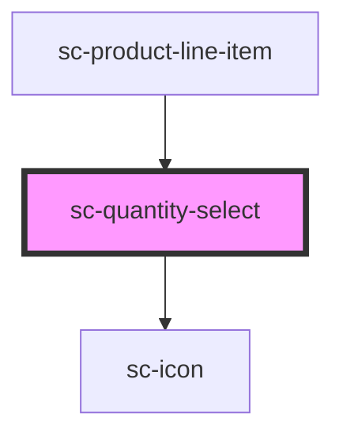

# ce-quantity-select

<!-- Auto Generated Below -->

## Properties

| Property   | Attribute   | Description  | Type          | Default     |
| ---------- | ----------- | ------------ | ------------- | ----------- |
| `clickEl`  | --          |              | `HTMLElement` | `undefined` |
| `disabled` | `disabled`  |              | `boolean`     | `undefined` |
| `hasFocus` | `has-focus` | Inputs focus | `boolean`     | `undefined` |
| `max`      | `max`       |              | `number`      | `Infinity`  |
| `min`      | `min`       |              | `number`      | `1`         |
| `quantity` | `quantity`  |              | `number`      | `0`         |

## Events

| Event      | Description                              | Type                  |
| ---------- | ---------------------------------------- | --------------------- |
| `scBlur`   | Emitted when the control loses focus.    | `CustomEvent<void>`   |
| `scChange` |                                          | `CustomEvent<number>` |
| `scFocus`  | Emitted when the control gains focus.    | `CustomEvent<void>`   |
| `scInput`  | Emitted when the control receives input. | `CustomEvent<number>` |

## Shadow Parts

| Part           | Description                |
| -------------- | -------------------------- |
| `"base"`       | The elements base wrapper. |
| `"input"`      | The input control.         |
| `"minus"`      | The minus control.         |
| `"minus-icon"` | The minus icon.            |
| `"plus"`       | The plus control.          |
| `"plus-icon"`  | The plus icon.             |

## Dependencies

### Used by

 - [sc-product-line-item](../product-line-item)

### Depends on

- [sc-icon](../icon)

### Graph

----------------------------------------------

*Built with [StencilJS](https://stenciljs.com/)*
