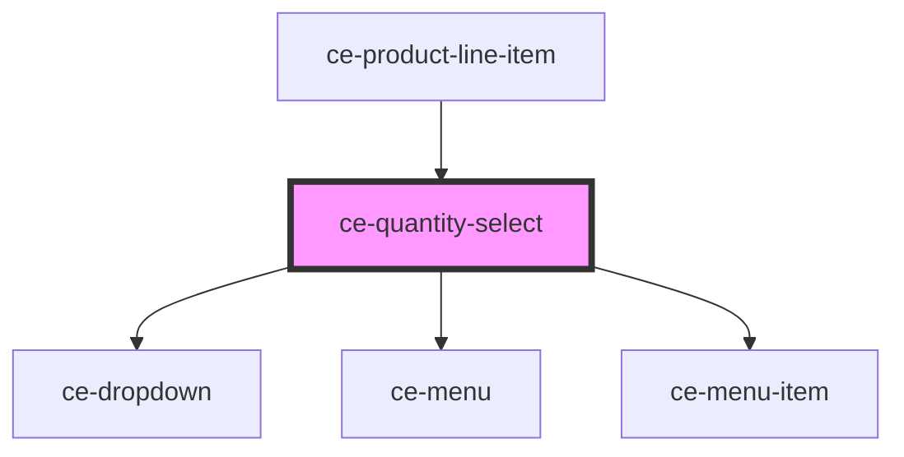

# ce-quantity-select

<!-- Auto Generated Below -->

## Properties

| Property   | Attribute  | Description | Type          | Default     |
| ---------- | ---------- | ----------- | ------------- | ----------- |
| `clickEl`  | --         |             | `HTMLElement` | `undefined` |
| `max`      | `max`      |             | `number`      | `100`       |
| `min`      | `min`      |             | `number`      | `1`         |
| `quantity` | `quantity` |             | `number`      | `0`         |

## Events

| Event      | Description | Type                  |
| ---------- | ----------- | --------------------- |
| `ceChange` |             | `CustomEvent<number>` |

## Dependencies

### Used by

 - [ce-product-line-item](../product-line-item)

### Depends on

- [ce-dropdown](../dropdown)
- [ce-menu](../menu)
- [ce-menu-item](../menu-item)

### Graph

----------------------------------------------

*Built with [StencilJS](https://stenciljs.com/)*
