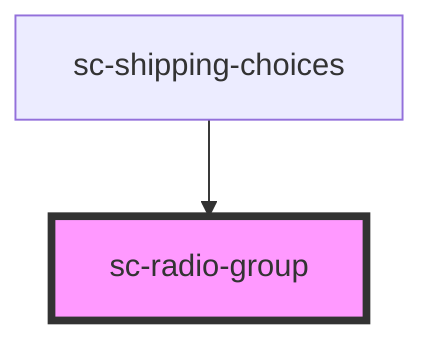

# ce-radio-group

<!-- Auto Generated Below -->

## Properties

| Property   | Attribute  | Description                                                                                                                                                                                                   | Type      | Default     |
| ---------- | ---------- | ------------------------------------------------------------------------------------------------------------------------------------------------------------------------------------------------------------- | --------- | ----------- |
| `invalid`  | `invalid`  | This will be true when the control is in an invalid state. Validity is determined by props such as `type`, `required`, `minlength`, `maxlength`, and `pattern` using the browser's constraint validation API. | `boolean` | `undefined` |
| `label`    | `label`    | The radio group label. Required for proper accessibility.                                                                                                                                                     | `string`  | `''`        |
| `required` | `required` | Is one of these items required.                                                                                                                                                                               | `boolean` | `undefined` |
| `value`    | `value`    | The selected value of the control.                                                                                                                                                                            | `string`  | `''`        |

## Methods

### `reportValidity() => Promise<boolean>`

Checks for validity and shows the browser's validation message if the control is invalid.

#### Returns

Type: `Promise<boolean>`

## Shadow Parts

| Part      | Description |
| --------- | ----------- |
| `"base"`  |             |
| `"label"` |             |

## Dependencies

### Used by

 - [sc-shipping-choices](../sc-shipping-choices)

### Graph

----------------------------------------------

*Built with [StencilJS](https://stenciljs.com/)*
