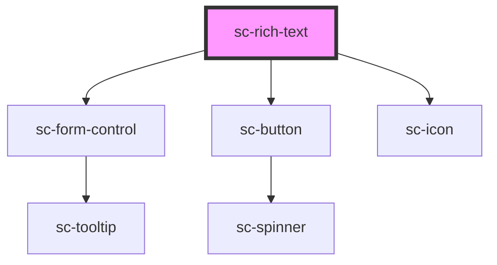

# sc-rich-text

<!-- Auto Generated Below -->

## Properties

| Property      | Attribute     | Description                                                              | Type                             | Default     |
| ------------- | ------------- | ------------------------------------------------------------------------ | -------------------------------- | ----------- |
| `disabled`    | `disabled`    | Disables the textarea.                                                   | `boolean`                        | `false`     |
| `help`        | `help`        | The textarea's help text. Alternatively, you can use the help-text slot. | `string`                         | `''`        |
| `label`       | `label`       | The textarea's label. Alternatively, you can use the label slot.         | `string`                         | `''`        |
| `name`        | `name`        | The textarea's name attribute.                                           | `string`                         | `undefined` |
| `placeholder` | `placeholder` | The textarea's placeholder text.                                         | `string`                         | `undefined` |
| `readonly`    | `readonly`    | Makes the textarea readonly.                                             | `boolean`                        | `false`     |
| `required`    | `required`    | Makes the textarea a required field.                                     | `boolean`                        | `false`     |
| `showLabel`   | `show-label`  | Should we show the label                                                 | `boolean`                        | `true`      |
| `size`        | `size`        | The textarea's size.                                                     | `"large" \| "medium" \| "small"` | `'medium'`  |
| `value`       | `value`       | The textarea's value attribute.                                          | `string`                         | `''`        |

## Shadow Parts

| Part       | Description |
| ---------- | ----------- |
| `"base"`   |             |
| `"editor"` |             |

## Dependencies

### Depends on

- [sc-form-control](../form-control)
- [sc-button](../button)
- [sc-icon](../icon)

### Graph

----------------------------------------------

*Built with [StencilJS](https://stenciljs.com/)*
