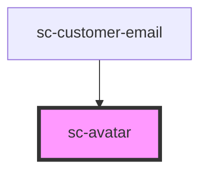

# sc-avatar

<!-- Auto Generated Below -->

## Properties

| Property   | Attribute  | Description                                                                                | Type                                | Default    |
| ---------- | ---------- | ------------------------------------------------------------------------------------------ | ----------------------------------- | ---------- |
| `image`    | `image`    | The image source to use for the avatar.                                                    | `string`                            | `''`       |
| `initials` | `initials` | Initials to use as a fallback when no image is available (1-2 characters max recommended). | `string`                            | `''`       |
| `label`    | `label`    | A label to use to describe the avatar to assistive devices.                                | `string`                            | `''`       |
| `loading`  | `loading`  | Indicates how the browser should load the image.                                           | `"eager" \| "lazy"`                 | `'eager'`  |
| `shape`    | `shape`    | The shape of the avatar.                                                                   | `"circle" \| "rounded" \| "square"` | `'circle'` |

## Shadow Parts

| Part         | Description |
| ------------ | ----------- |
| `"base"`     |             |
| `"icon"`     |             |
| `"image"`    |             |
| `"initials"` |             |

## Dependencies

### Used by

 - [sc-customer-email](../../controllers/checkout-form/customer-email)

### Graph

----------------------------------------------

*Built with [StencilJS](https://stenciljs.com/)*
