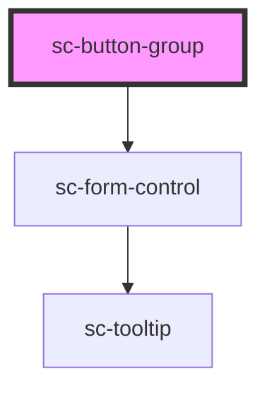

# ce-button-group

<!-- Auto Generated Below -->

## Properties

| Property   | Attribute  | Description | Type      | Default     |
| ---------- | ---------- | ----------- | --------- | ----------- |
| `label`    | `label`    |             | `string`  | `undefined` |
| `separate` | `separate` |             | `boolean` | `undefined` |

## Shadow Parts

| Part     | Description |
| -------- | ----------- |
| `"base"` |             |

## Dependencies

### Depends on

- [sc-form-control](../form-control)

### Graph

----------------------------------------------

*Built with [StencilJS](https://stenciljs.com/)*
