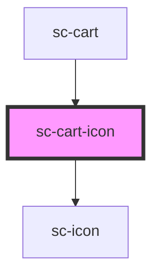

# sc-cart-icon

<!-- Auto Generated Below -->

## Properties

| Property | Attribute | Description                         | Type     | Default          |
| -------- | --------- | ----------------------------------- | -------- | ---------------- |
| `count`  | `count`   | The count to show in the cart icon. | `number` | `0`              |
| `icon`   | `icon`    | The icon to show.                   | `string` | `'shopping-bag'` |

## Shadow Parts

| Part     | Description |
| -------- | ----------- |
| `"base"` |             |

## Dependencies

### Used by

 - [sc-cart](../../controllers/cart/sc-cart)

### Depends on

- [sc-icon](../icon)

### Graph

----------------------------------------------

*Built with [StencilJS](https://stenciljs.com/)*
