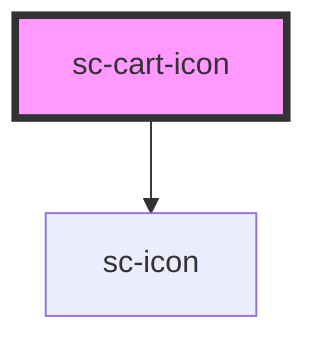

# sc-cart-icon

<!-- Auto Generated Below -->

## Properties

| Property | Attribute | Description                         | Type               | Default          |
| -------- | --------- | ----------------------------------- | ------------------ | ---------------- |
| `count`  | `count`   | The count to show in the cart icon. | `number`           | `0`              |
| `formId` | `form-id` | The form id to use for the cart.    | `string`           | `undefined`      |
| `icon`   | `icon`    | The icon to show.                   | `string`           | `'shopping-bag'` |
| `mode`   | `mode`    | Are we in test or live mode.        | `"live" \| "test"` | `'live'`         |

## Shadow Parts

| Part           | Description                |
| -------------- | -------------------------- |
| `"base"`       | The elements base wrapper. |
| `"container"`  | The container.             |
| `"icon__base"` | The icon base wrapper.     |

## Dependencies

### Depends on

- [sc-icon](../icon)

### Graph

----------------------------------------------

*Built with [StencilJS](https://stenciljs.com/)*
