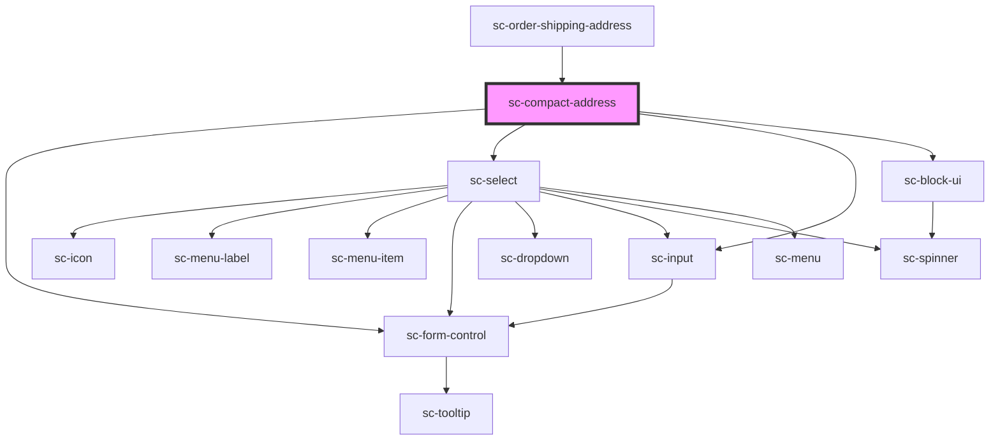

# sc-compact-address

<!-- Auto Generated Below -->

## Properties

| Property   | Attribute  | Description           | Type                                                                                                                                                                                                                                                                                                                                                                            | Default                                                                                                                                                                                                 |
| ---------- | ---------- | --------------------- | ------------------------------------------------------------------------------------------------------------------------------------------------------------------------------------------------------------------------------------------------------------------------------------------------------------------------------------------------------------------------------- | ------------------------------------------------------------------------------------------------------------------------------------------------------------------------------------------------------- |
| `address`  | --         | The address.          | `{ name?: string; line_1?: string; line_2?: string; city?: string; state?: string; postal_code?: string; country?: string; constructor?: Function; toString?: () => string; toLocaleString?: () => string; valueOf?: () => Object; hasOwnProperty?: (v: PropertyKey) => boolean; isPrototypeOf?: (v: Object) => boolean; propertyIsEnumerable?: (v: PropertyKey) => boolean; }` | `{     country: null,     city: null,     line_1: null,     line_2: null,     postal_code: null,     state: null,   }`                                                                                  |
| `label`    | `label`    | Label for the address | `string`                                                                                                                                                                                                                                                                                                                                                                        | `__('Country or region', 'surecart')`                                                                                                                                                                   |
| `loading`  | `loading`  | Is this loading       | `boolean`                                                                                                                                                                                                                                                                                                                                                                       | `undefined`                                                                                                                                                                                             |
| `names`    | --         |                       | `{ name?: string; line_1?: string; line_2?: string; city?: string; state?: string; postal_code?: string; country?: string; constructor?: Function; toString?: () => string; toLocaleString?: () => string; valueOf?: () => Object; hasOwnProperty?: (v: PropertyKey) => boolean; isPrototypeOf?: (v: Object) => boolean; propertyIsEnumerable?: (v: PropertyKey) => boolean; }` | `{     country: 'shipping_country',     city: 'shipping_city',     line_1: 'shipping_line_1',     line_2: 'shipping_line_2',     postal_code: 'shipping_postal_code',     state: 'shipping_state',   }` |
| `required` | `required` | Is this required?     | `boolean`                                                                                                                                                                                                                                                                                                                                                                       | `undefined`                                                                                                                                                                                             |

## Events

| Event             | Description           | Type                                                                                                                                                                                                                                                                                                                                                                                         |
| ----------------- | --------------------- | -------------------------------------------------------------------------------------------------------------------------------------------------------------------------------------------------------------------------------------------------------------------------------------------------------------------------------------------------------------------------------------------- |
| `scChangeAddress` | Address change event. | `CustomEvent<{ name?: string; line_1?: string; line_2?: string; city?: string; state?: string; postal_code?: string; country?: string; constructor?: Function; toString?: () => string; toLocaleString?: () => string; valueOf?: () => Object; hasOwnProperty?: (v: PropertyKey) => boolean; isPrototypeOf?: (v: Object) => boolean; propertyIsEnumerable?: (v: PropertyKey) => boolean; }>` |

## Shadow Parts

| Part        | Description |
| ----------- | ----------- |
| `"control"` |             |

## Dependencies

### Used by

 - [sc-order-shipping-address](../../controllers/checkout-form/order-shipping-address)

### Depends on

- [sc-form-control](../form-control)
- [sc-select](../select)
- [sc-input](../input)
- [sc-block-ui](../block-ui)

### Graph

----------------------------------------------

*Built with [StencilJS](https://stenciljs.com/)*
