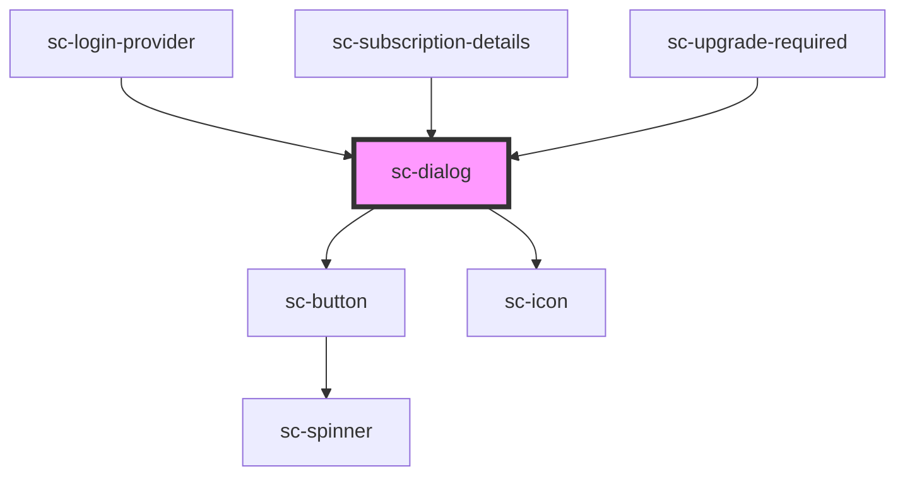

# sc-dialog

<!-- Auto Generated Below -->

## Properties

| Property   | Attribute   | Description                                                                                                                                                        | Type      | Default |
| ---------- | ----------- | ------------------------------------------------------------------------------------------------------------------------------------------------------------------ | --------- | ------- |
| `label`    | `label`     | The dialog's label as displayed in the header. You should always include a relevant label even when using `no-header`, as it is required for proper accessibility. | `string`  | `''`    |
| `noHeader` | `no-header` | Disables the header. This will also remove the default close button, so please ensure you provide an easy, accessible way for users to dismiss the dialog.         | `boolean` | `false` |
| `open`     | `open`      | Indicates whether or not the dialog is open. You can use this in lieu of the show/hide methods.                                                                    | `boolean` | `false` |

## Events

| Event            | Description         | Type                                                     |
| ---------------- | ------------------- | -------------------------------------------------------- |
| `scAfterHide`    |                     | `CustomEvent<void>`                                      |
| `scAfterShow`    |                     | `CustomEvent<void>`                                      |
| `scHide`         |                     | `CustomEvent<void>`                                      |
| `scInitialFocus` |                     | `CustomEvent<void>`                                      |
| `scRequestClose` | Request close event | `CustomEvent<"close-button" \| "keyboard" \| "overlay">` |
| `scShow`         |                     | `CustomEvent<void>`                                      |

## Shadow Parts

| Part             | Description |
| ---------------- | ----------- |
| `"base"`         |             |
| `"body"`         |             |
| `"close-button"` |             |
| `"footer"`       |             |
| `"header"`       |             |
| `"overlay"`      |             |
| `"panel"`        |             |
| `"title"`        |             |

## Dependencies

### Used by

 - [sc-login-provider](../../providers/sc-login-provider)
 - [sc-subscription-details](../../controllers/dashboard/subscription-details)
 - [sc-upgrade-required](../sc-upgrade-required)

### Depends on

- [sc-button](../button)
- [sc-icon](../icon)

### Graph

----------------------------------------------

*Built with [StencilJS](https://stenciljs.com/)*
