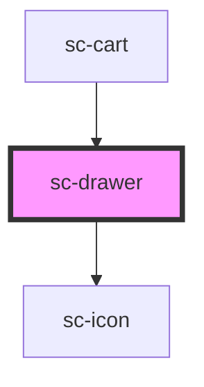

# sc-drawer

<!-- Auto Generated Below -->

## Properties

| Property    | Attribute   | Description                                                                                                                                                                                     | Type                                    | Default |
| ----------- | ----------- | ----------------------------------------------------------------------------------------------------------------------------------------------------------------------------------------------- | --------------------------------------- | ------- |
| `contained` | `contained` | By default, the drawer slides out of its containing block (usually the viewport). To make the drawer slide out of its parent element, set this prop and add `position: relative` to the parent. | `boolean`                               | `false` |
| `label`     | `label`     | The drawer's label as displayed in the header. You should always include a relevant label even when using `no-header`, as it is required for proper accessibility.                              | `string`                                | `''`    |
| `noHeader`  | `no-header` | Removes the header. This will also remove the default close button, so please ensure you provide an easy, accessible way for users to dismiss the drawer.                                       | `boolean`                               | `false` |
| `open`      | `open`      | Indicates whether or not the drawer is open. You can use this in lieu of the show/hide methods.                                                                                                 | `boolean`                               | `false` |
| `placement` | `placement` | The direction from which the drawer will open.                                                                                                                                                  | `"bottom" \| "end" \| "start" \| "top"` | `'end'` |

## Events

| Event            | Description | Type                                                     |
| ---------------- | ----------- | -------------------------------------------------------- |
| `scAfterHide`    |             | `CustomEvent<void>`                                      |
| `scAfterShow`    |             | `CustomEvent<void>`                                      |
| `scHide`         |             | `CustomEvent<void>`                                      |
| `scInitialFocus` |             | `CustomEvent<void>`                                      |
| `scRequestClose` |             | `CustomEvent<"close-button" \| "keyboard" \| "overlay">` |
| `scShow`         |             | `CustomEvent<void>`                                      |

## Shadow Parts

| Part              | Description |
| ----------------- | ----------- |
| `"base"`          |             |
| `"body"`          |             |
| `"close-button"`  |             |
| `"footer"`        |             |
| `"header"`        |             |
| `"header-suffix"` |             |
| `"overlay"`       |             |
| `"panel"`         |             |
| `"title"`         |             |

## Dependencies

### Used by

 - [sc-cart](../../controllers/cart/sc-cart)

### Depends on

- [sc-icon](../icon)

### Graph

----------------------------------------------

*Built with [StencilJS](https://stenciljs.com/)*
