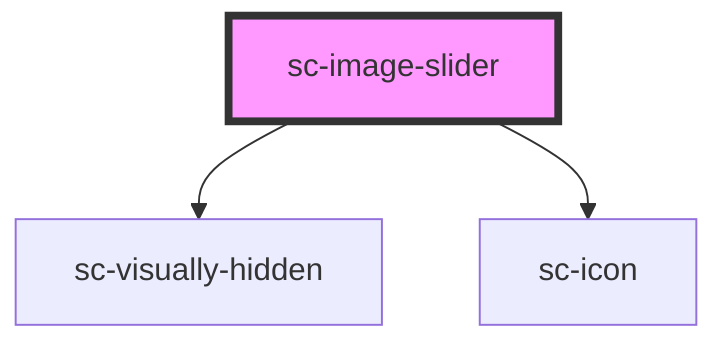

# sc-product-image-carousel

<!-- Auto Generated Below -->

## Properties

| Property            | Attribute             | Description                            | Type                                                                                                                  | Default     |
| ------------------- | --------------------- | -------------------------------------- | --------------------------------------------------------------------------------------------------------------------- | ----------- |
| `autoHeight`        | `auto-height`         |                                        | `boolean`                                                                                                             | `undefined` |
| `hasThumbnails`     | `has-thumbnails`      |                                        | `boolean`                                                                                                             | `undefined` |
| `images`            | `images`              | Accept a string or an array of objects | `string \| { src: string; alt: string; srcset: any; width: number; height: number; sizes: string; title: string; }[]` | `undefined` |
| `thumbnails`        | `thumbnails`          |                                        | `string \| { src: string; alt: string; srcset: any; width: number; height: number; sizes: string; title: string; }[]` | `[]`        |
| `thumbnailsPerPage` | `thumbnails-per-page` |                                        | `number`                                                                                                              | `5`         |

## Shadow Parts

| Part     | Description |
| -------- | ----------- |
| `"base"` |             |

## Dependencies

### Depends on

- [sc-visually-hidden](../../util/visually-hidden)
- [sc-icon](../icon)

### Graph

----------------------------------------------

*Built with [StencilJS](https://stenciljs.com/)*
