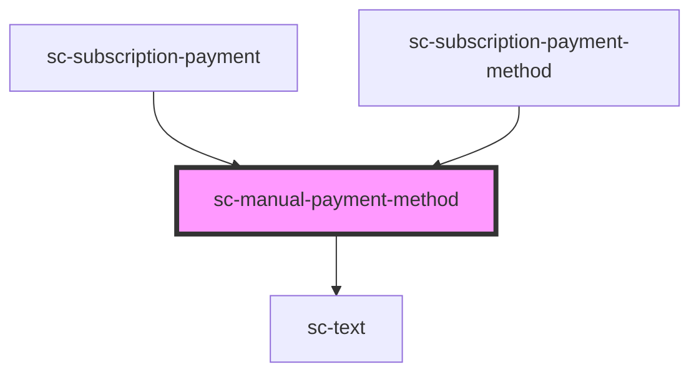

# sc-manual-payment-method

<!-- Auto Generated Below -->

## Properties

| Property        | Attribute | Description | Type                  | Default     |
| --------------- | --------- | ----------- | --------------------- | ----------- |
| `paymentMethod` | --        |             | `ManualPaymentMethod` | `undefined` |

## Shadow Parts

| Part     | Description |
| -------- | ----------- |
| `"card"` |             |

## Dependencies

### Used by

 - [sc-subscription-payment](../../controllers/dashboard/subscription-payment)
 - [sc-subscription-payment-method](../../controllers/dashboard/sc-subscription-payment-method)

### Depends on

- [sc-text](../text)

### Graph

----------------------------------------------

*Built with [StencilJS](https://stenciljs.com/)*
