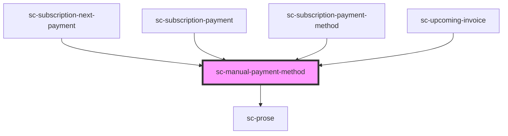

# sc-manual-payment-method

<!-- Auto Generated Below -->

## Properties

| Property          | Attribute          | Description | Type                  | Default     |
| ----------------- | ------------------ | ----------- | --------------------- | ----------- |
| `paymentMethod`   | --                 |             | `ManualPaymentMethod` | `undefined` |
| `showDescription` | `show-description` |             | `boolean`             | `false`     |

## Shadow Parts

| Part     | Description |
| -------- | ----------- |
| `"card"` |             |

## Dependencies

### Used by

 - [sc-subscription-next-payment](../../controllers/dashboard/subscription-details)
 - [sc-subscription-payment](../../controllers/dashboard/subscription-payment)
 - [sc-subscription-payment-method](../../controllers/dashboard/sc-subscription-payment-method)
 - [sc-upcoming-invoice](../../controllers/dashboard/upcoming-invoice)

### Depends on

- [sc-prose](../sc-prose)

### Graph

----------------------------------------------

*Built with [StencilJS](https://stenciljs.com/)*
