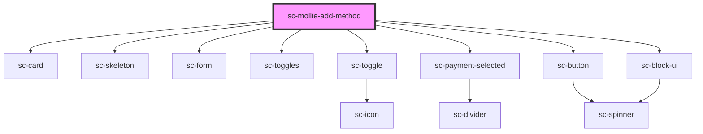

# sc-mollie-add-method

<!-- Auto Generated Below -->

## Properties

| Property      | Attribute      | Description | Type      | Default     |
| ------------- | -------------- | ----------- | --------- | ----------- |
| `country`     | `country`      |             | `string`  | `undefined` |
| `currency`    | `currency`     |             | `string`  | `undefined` |
| `customerId`  | `customer-id`  |             | `string`  | `undefined` |
| `liveMode`    | `live-mode`    |             | `boolean` | `undefined` |
| `processorId` | `processor-id` |             | `string`  | `undefined` |
| `successUrl`  | `success-url`  |             | `string`  | `undefined` |

## Dependencies

### Depends on

- [sc-card](../card)
- [sc-skeleton](../skeleton)
- [sc-form](../form)
- [sc-toggles](../sc-toggles)
- [sc-toggle](../sc-toggle)
- [sc-payment-selected](../payment-selected)
- [sc-button](../button)
- [sc-block-ui](../block-ui)

### Graph

----------------------------------------------

*Built with [StencilJS](https://stenciljs.com/)*
