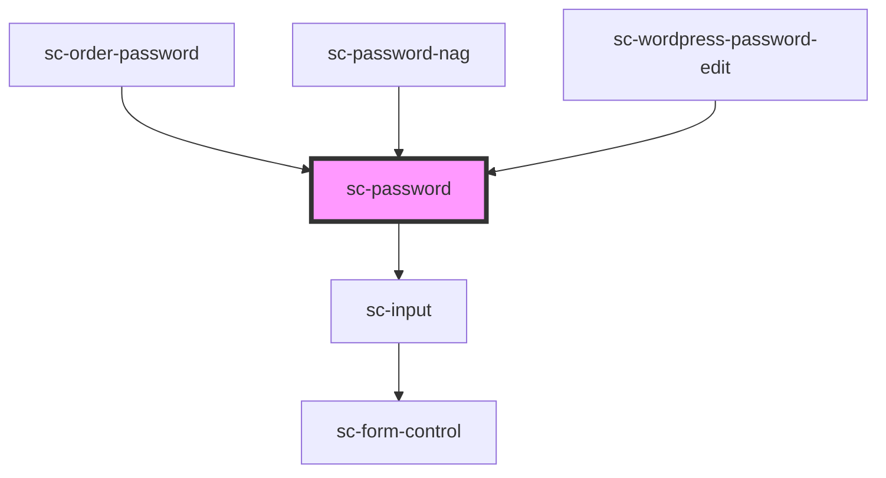

# sc-password

<!-- Auto Generated Below -->

## Properties

| Property                  | Attribute                  | Description                                  | Type                             | Default      |
| ------------------------- | -------------------------- | -------------------------------------------- | -------------------------------- | ------------ |
| `autofocus`               | `autofocus`                | The input's autofocus attribute.             | `boolean`                        | `undefined`  |
| `confirmation`            | `confirmation`             | The input's password confirmation attribute. | `boolean`                        | `false`      |
| `confirmationHelp`        | `confirmation-help`        | The input's confirmation help text.          | `string`                         | `undefined`  |
| `confirmationLabel`       | `confirmation-label`       | The input's confirmation label text.         | `string`                         | `undefined`  |
| `confirmationPlaceholder` | `confirmation-placeholder` | The input's confirmation placeholder text.   | `string`                         | `undefined`  |
| `disabled`                | `disabled`                 | Disables the input.                          | `boolean`                        | `false`      |
| `enableValidation`        | `enable-validation`        | Ensures strong password validation.          | `boolean`                        | `true`       |
| `help`                    | `help`                     | The input's help text.                       | `string`                         | `''`         |
| `label`                   | `label`                    | The input's label.                           | `string`                         | `undefined`  |
| `name`                    | `name`                     | The name for the input.                      | `string`                         | `'password'` |
| `pill`                    | `pill`                     | Draws a pill-style input with rounded edges. | `boolean`                        | `false`      |
| `placeholder`             | `placeholder`              | The input's placeholder text.                | `string`                         | `undefined`  |
| `readonly`                | `readonly`                 | Makes the input readonly.                    | `boolean`                        | `false`      |
| `required`                | `required`                 | Makes the input a required field.            | `boolean`                        | `false`      |
| `showLabel`               | `show-label`               | Should we show the label                     | `boolean`                        | `true`       |
| `size`                    | `size`                     | The input's size.                            | `"large" \| "medium" \| "small"` | `'medium'`   |
| `value`                   | `value`                    | The input's value attribute.                 | `string`                         | `''`         |

## Methods

### `reportValidity() => Promise<boolean>`

#### Returns

Type: `Promise<boolean>`

### `triggerFocus(options?: FocusOptions) => Promise<void>`

Sets focus on the input.

#### Returns

Type: `Promise<void>`

## Dependencies

### Used by

 - [sc-order-password](../../controllers/checkout-form/order-password)
 - [sc-password-nag](../../controllers/dashboard/sc-password-nag)
 - [sc-wordpress-password-edit](../../controllers/dashboard/wordpress-password-edit)

### Depends on

- [sc-input](../input)

### Graph

----------------------------------------------

*Built with [StencilJS](https://stenciljs.com/)*
