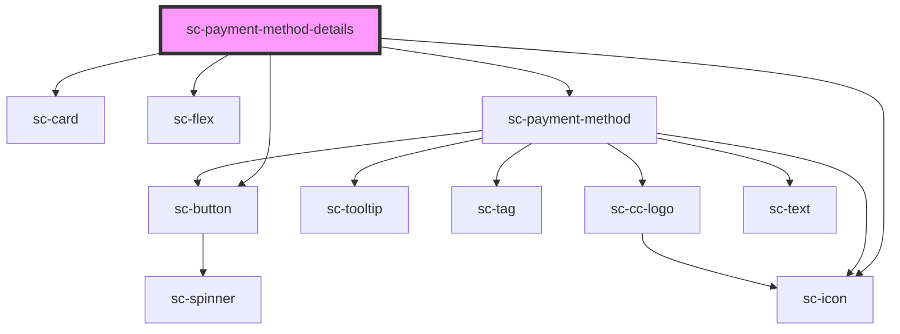

# sc-payment-method-details

<!-- Auto Generated Below -->

## Properties

| Property        | Attribute | Description | Type            | Default     |
| --------------- | --------- | ----------- | --------------- | ----------- |
| `editHandler`   | --        |             | `() => void`    | `undefined` |
| `paymentMethod` | --        |             | `PaymentMethod` | `undefined` |

## Dependencies

### Depends on

- [sc-card](../card)
- [sc-flex](../flex)
- [sc-payment-method](../sc-payment-method)
- [sc-button](../button)
- [sc-icon](../icon)

### Graph

----------------------------------------------

*Built with [StencilJS](https://stenciljs.com/)*
