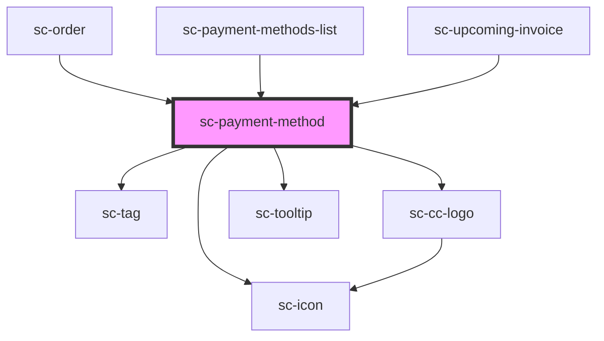

# sc-payment-method

<!-- Auto Generated Below -->

## Properties

| Property        | Attribute | Description | Type            | Default     |
| --------------- | --------- | ----------- | --------------- | ----------- |
| `paymentMethod` | --        |             | `PaymentMethod` | `undefined` |

## Shadow Parts

| Part     | Description |
| -------- | ----------- |
| `"base"` |             |

## Dependencies

### Used by

 - [sc-order](../../controllers/dashboard/order)
 - [sc-payment-methods-list](../../controllers/dashboard/payment-methods-list)
 - [sc-upcoming-invoice](../../controllers/dashboard/upcoming-invoice)

### Depends on

- [sc-tag](../tag)
- [sc-cc-logo](../cc-logo)
- [sc-tooltip](../tooltip)
- [sc-icon](../icon)

### Graph

----------------------------------------------

*Built with [StencilJS](https://stenciljs.com/)*
