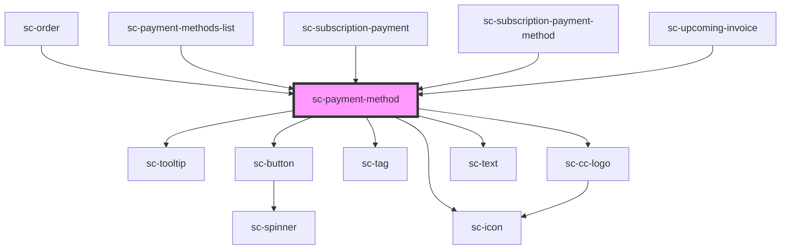

# sc-payment-method

<!-- Auto Generated Below -->

## Properties

| Property                  | Attribute                    | Description | Type            | Default     |
| ------------------------- | ---------------------------- | ----------- | --------------- | ----------- |
| `externalLink`            | `external-link`              |             | `string`        | `undefined` |
| `externalLinkTooltipText` | `external-link-tooltip-text` |             | `string`        | `undefined` |
| `full`                    | `full`                       |             | `boolean`       | `undefined` |
| `paymentMethod`           | --                           |             | `PaymentMethod` | `undefined` |

## Shadow Parts

| Part           | Description |
| -------------- | ----------- |
| `"bank"`       |             |
| `"base"`       |             |
| `"card"`       |             |
| `"instrument"` |             |

## Dependencies

### Used by

 - [sc-order](../../controllers/dashboard/order)
 - [sc-payment-methods-list](../../controllers/dashboard/payment-methods-list)
 - [sc-subscription-payment](../../controllers/dashboard/subscription-payment)
 - [sc-subscription-payment-method](../../controllers/dashboard/sc-subscription-payment-method)
 - [sc-upcoming-invoice](../../controllers/dashboard/upcoming-invoice)

### Depends on

- [sc-tooltip](../tooltip)
- [sc-button](../button)
- [sc-icon](../icon)
- [sc-tag](../tag)
- [sc-cc-logo](../cc-logo)
- [sc-text](../text)

### Graph

----------------------------------------------

*Built with [StencilJS](https://stenciljs.com/)*
