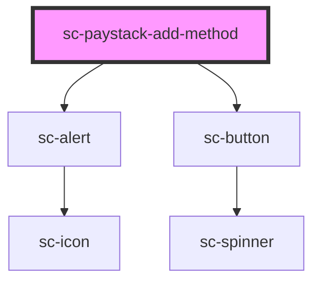

# sc-paystack-add-method

<!-- Auto Generated Below -->

## Properties

| Property     | Attribute     | Description | Type      | Default     |
| ------------ | ------------- | ----------- | --------- | ----------- |
| `currency`   | `currency`    |             | `string`  | `undefined` |
| `customerId` | `customer-id` |             | `string`  | `undefined` |
| `liveMode`   | `live-mode`   |             | `boolean` | `true`      |
| `successUrl` | `success-url` |             | `string`  | `undefined` |

## Dependencies

### Depends on

- [sc-alert](../alert)
- [sc-button](../button)

### Graph

----------------------------------------------

*Built with [StencilJS](https://stenciljs.com/)*
