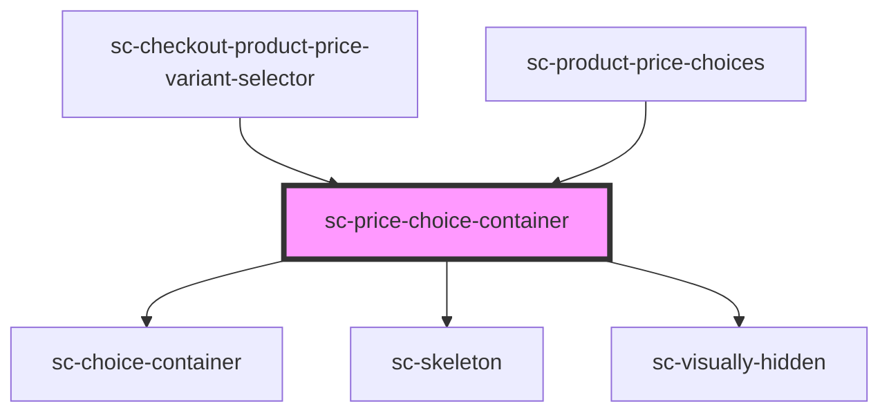

# sc-price-choice-container

<!-- Auto Generated Below -->

## Properties

| Property      | Attribute      | Description                     | Type                    | Default     |
| ------------- | -------------- | ------------------------------- | ----------------------- | ----------- |
| `checked`     | `checked`      | Is this checked by default      | `boolean`               | `false`     |
| `description` | `description`  | Label for the choice.           | `string`                | `undefined` |
| `label`       | `label`        | Label for the choice.           | `string`                | `undefined` |
| `loading`     | `loading`      | Is this loading                 | `boolean`               | `false`     |
| `price`       | `price`        | Stores the price                | `Price \| string`       | `undefined` |
| `required`    | `required`     |                                 | `boolean`               | `false`     |
| `showControl` | `show-control` | Show the radio/checkbox control | `boolean`               | `false`     |
| `showLabel`   | `show-label`   | Show the label                  | `boolean`               | `true`      |
| `showPrice`   | `show-price`   | Show the price amount           | `boolean`               | `true`      |
| `type`        | `type`         | Choice Type                     | `"checkbox" \| "radio"` | `undefined` |

## Events

| Event      | Description | Type                |
| ---------- | ----------- | ------------------- |
| `scChange` |             | `CustomEvent<void>` |

## Dependencies

### Used by

 - [sc-checkout-product-price-variant-selector](../../controllers/checkout-form/sc-checkout-product-price-variant-selector)
 - [sc-product-price-choices](../../controllers/product/sc-product-price-choices)

### Depends on

- [sc-choice-container](../choice-container)
- [sc-skeleton](../skeleton)
- [sc-visually-hidden](../../util/visually-hidden)

### Graph

----------------------------------------------

*Built with [StencilJS](https://stenciljs.com/)*
