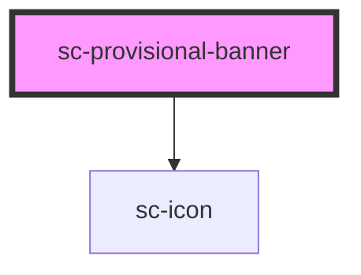

# sc-provisional-banner

<!-- Auto Generated Below -->

## Properties

| Property   | Attribute   | Description | Type     | Default |
| ---------- | ----------- | ----------- | -------- | ------- |
| `claimUrl` | `claim-url` | Claim URL.  | `string` | `''`    |

## Dependencies

### Depends on

- [sc-icon](../icon)

### Graph

----------------------------------------------

*Built with [StencilJS](https://stenciljs.com/)*
