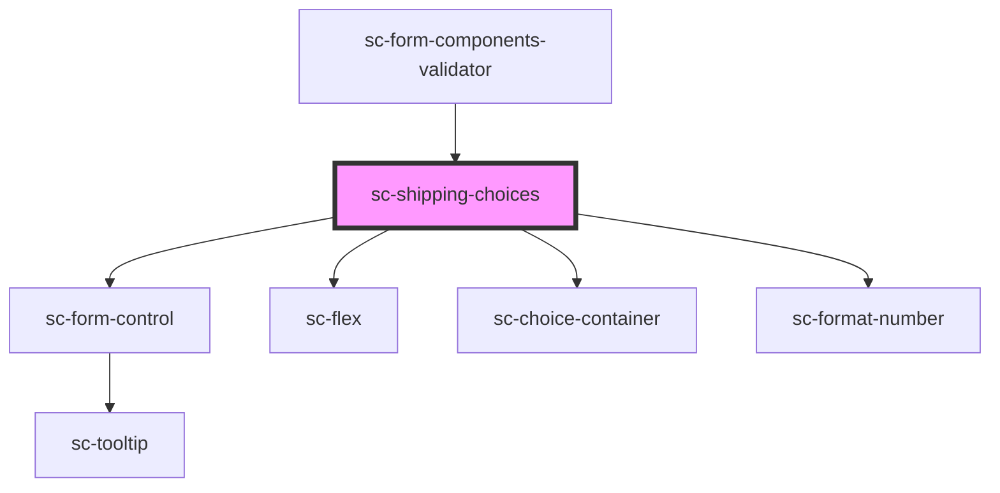

# sc-shipping-choices

<!-- Auto Generated Below -->

## Properties

| Property          | Attribute          | Description                                     | Type               | Default     |
| ----------------- | ------------------ | ----------------------------------------------- | ------------------ | ----------- |
| `label`           | `label`            | The shipping section label                      | `string`           | `undefined` |
| `shippingChoices` | --                 | Shipping choices                                | `ShippingChoice[]` | `[]`        |
| `showControl`     | `show-control`     | Show control on shipping option                 | `boolean`          | `true`      |
| `showDescription` | `show-description` | Whether to show the shipping choice description | `boolean`          | `true`      |

## Events

| Event     | Description | Type                         |
| --------- | ----------- | ---------------------------- |
| `scError` | Error event | `CustomEvent<ResponseError>` |

## Dependencies

### Used by

 - [sc-form-components-validator](../../providers/form-components-validator)

### Depends on

- [sc-form-control](../form-control)
- [sc-flex](../flex)
- [sc-choice-container](../choice-container)
- [sc-format-number](../../util/format-number)

### Graph

----------------------------------------------

*Built with [StencilJS](https://stenciljs.com/)*
