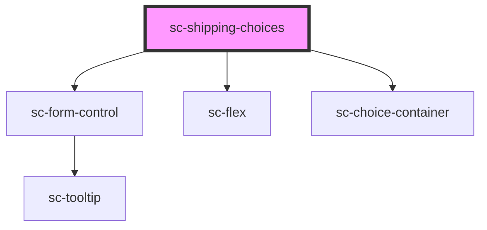

# sc-shipping-choices

<!-- Auto Generated Below -->

## Properties

| Property      | Attribute      | Description                     | Type      | Default     |
| ------------- | -------------- | ------------------------------- | --------- | ----------- |
| `label`       | `label`        | The shipping section label      | `string`  | `undefined` |
| `showControl` | `show-control` | Show control on shipping option | `boolean` | `true`      |

## Dependencies

### Depends on

- [sc-form-control](../form-control)
- [sc-flex](../flex)
- [sc-choice-container](../choice-container)

### Graph

----------------------------------------------

*Built with [StencilJS](https://stenciljs.com/)*
