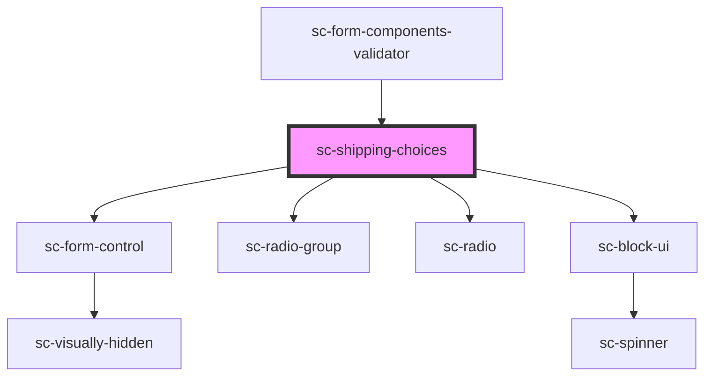

# sc-shipping-choices

<!-- Auto Generated Below -->

## Properties

| Property          | Attribute          | Description                                     | Type      | Default     |
| ----------------- | ------------------ | ----------------------------------------------- | --------- | ----------- |
| `label`           | `label`            | The shipping section label                      | `string`  | `undefined` |
| `showDescription` | `show-description` | Whether to show the shipping choice description | `boolean` | `true`      |

## Shadow Parts

| Part                    | Description                |
| ----------------------- | -------------------------- |
| `"base"`                | The elements base wrapper. |
| `"block-ui"`            | The block ui loader.       |
| `"empty"`               | The empty message.         |
| `"radio__base"`         | The radio base wrapper.    |
| `"radio__checked-icon"` | The radio checked icon.    |
| `"radio__control"`      | The radio control wrapper. |
| `"radio__label"`        | The radio label.           |

## Dependencies

### Used by

 - [sc-form-components-validator](../../providers/form-components-validator)

### Depends on

- [sc-form-control](../form-control)
- [sc-radio-group](../radio-group)
- [sc-radio](../radio)
- [sc-block-ui](../block-ui)

### Graph

----------------------------------------------

*Built with [StencilJS](https://stenciljs.com/)*
