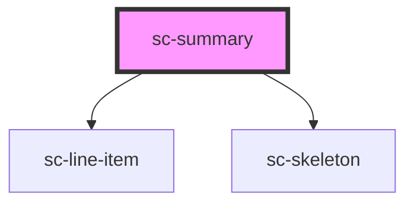

# sc-summary

<!-- Auto Generated Below -->

## Properties

| Property             | Attribute              | Description | Type      | Default                          |
| -------------------- | ---------------------- | ----------- | --------- | -------------------------------- |
| `busy`               | `busy`                 |             | `boolean` | `undefined`                      |
| `closedText`         | `closed-text`          |             | `string`  | `__('Show Summary', 'surecart')` |
| `collapsed`          | `collapsed`            |             | `boolean` | `false`                          |
| `collapsedOnDesktop` | `collapsed-on-desktop` |             | `boolean` | `undefined`                      |
| `collapsedOnMobile`  | `collapsed-on-mobile`  |             | `boolean` | `false`                          |
| `collapsible`        | `collapsible`          |             | `boolean` | `false`                          |
| `loading`            | `loading`              |             | `boolean` | `undefined`                      |
| `openText`           | `open-text`            |             | `string`  | `__('Summary', 'surecart')`      |

## Events

| Event    | Description     | Type                |
| -------- | --------------- | ------------------- |
| `scHide` | Show the toggle | `CustomEvent<void>` |
| `scShow` | Show the toggle | `CustomEvent<void>` |

## Dependencies

### Depends on

- [sc-line-item](../line-item)
- [sc-skeleton](../skeleton)

### Graph

----------------------------------------------

*Built with [StencilJS](https://stenciljs.com/)*
