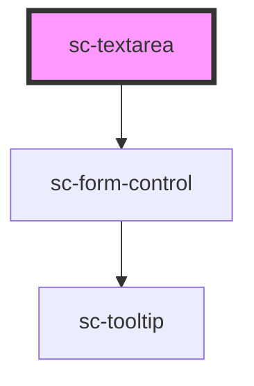

# sc-textarea

<!-- Auto Generated Below -->

## Properties

| Property         | Attribute        | Description                                                                                                                                                                                        | Type                                                                                  | Default      |
| ---------------- | ---------------- | -------------------------------------------------------------------------------------------------------------------------------------------------------------------------------------------------- | ------------------------------------------------------------------------------------- | ------------ |
| `autocapitalize` | `autocapitalize` | The textarea's autocapitalize attribute.                                                                                                                                                           | `"characters" \| "none" \| "off" \| "on" \| "sentences" \| "words"`                   | `undefined`  |
| `autocomplete`   | `autocomplete`   | The textarea's autocomplete attribute.                                                                                                                                                             | `string`                                                                              | `undefined`  |
| `autocorrect`    | `autocorrect`    | The textarea's autocorrect attribute.                                                                                                                                                              | `string`                                                                              | `undefined`  |
| `autofocus`      | `autofocus`      | The textarea's autofocus attribute.                                                                                                                                                                | `boolean`                                                                             | `undefined`  |
| `disabled`       | `disabled`       | Disables the textarea.                                                                                                                                                                             | `boolean`                                                                             | `false`      |
| `enterkeyhint`   | `enterkeyhint`   | The input's enterkeyhint attribute. This can be used to customize the label or icon of the Enter key on virtual keyboards.                                                                         | `"done" \| "enter" \| "go" \| "next" \| "previous" \| "search" \| "send"`             | `undefined`  |
| `filled`         | `filled`         | Draws a filled textarea.                                                                                                                                                                           | `boolean`                                                                             | `false`      |
| `help`           | `help-text`      | The textarea's help text. Alternatively, you can use the help-text slot.                                                                                                                           | `string`                                                                              | `''`         |
| `inputmode`      | `inputmode`      | The textarea's inputmode attribute.                                                                                                                                                                | `"decimal" \| "email" \| "none" \| "numeric" \| "search" \| "tel" \| "text" \| "url"` | `undefined`  |
| `invalid`        | `invalid`        | This will be true when the control is in an invalid state. Validity is determined by props such as `type`, `required`, `minlength`, and `maxlength` using the browser's constraint validation API. | `boolean`                                                                             | `false`      |
| `label`          | `label`          | The textarea's label. Alternatively, you can use the label slot.                                                                                                                                   | `string`                                                                              | `''`         |
| `maxlength`      | `maxlength`      | The maximum length of input that will be considered valid.                                                                                                                                         | `number`                                                                              | `undefined`  |
| `minlength`      | `minlength`      | The minimum length of input that will be considered valid.                                                                                                                                         | `number`                                                                              | `undefined`  |
| `name`           | `name`           | The textarea's name attribute.                                                                                                                                                                     | `string`                                                                              | `undefined`  |
| `placeholder`    | `placeholder`    | The textarea's placeholder text.                                                                                                                                                                   | `string`                                                                              | `undefined`  |
| `readonly`       | `readonly`       | Makes the textarea readonly.                                                                                                                                                                       | `boolean`                                                                             | `false`      |
| `required`       | `required`       | Makes the textarea a required field.                                                                                                                                                               | `boolean`                                                                             | `false`      |
| `resize`         | `resize`         | Controls how the textarea can be resized.                                                                                                                                                          | `"auto" \| "none" \| "vertical"`                                                      | `'vertical'` |
| `rows`           | `rows`           | The number of rows to display by default.                                                                                                                                                          | `number`                                                                              | `4`          |
| `showLabel`      | `show-label`     | Should we show the label                                                                                                                                                                           | `boolean`                                                                             | `true`       |
| `size`           | `size`           | The textarea's size.                                                                                                                                                                               | `"large" \| "medium" \| "small"`                                                      | `'medium'`   |
| `spellcheck`     | `spellcheck`     | Enables spell checking on the textarea.                                                                                                                                                            | `boolean`                                                                             | `undefined`  |
| `value`          | `value`          | The textarea's value attribute.                                                                                                                                                                    | `string`                                                                              | `''`         |

## Events

| Event      | Description | Type                |
| ---------- | ----------- | ------------------- |
| `scBlur`   |             | `CustomEvent<void>` |
| `scChange` |             | `CustomEvent<void>` |
| `scFocus`  |             | `CustomEvent<void>` |
| `scInput`  |             | `CustomEvent<void>` |

## Methods

### `reportValidity() => Promise<boolean>`

Checks for validity and shows the browser's validation message if the control is invalid.

#### Returns

Type: `Promise<boolean>`

## Shadow Parts

| Part                   | Description                                    |
| ---------------------- | ---------------------------------------------- |
| `"base"`               | The elements base wrapper.                     |
| `"form-control"`       | The form control wrapper.                      |
| `"form-control-input"` |                                                |
| `"help-text"`          | Help text that describes how to use the input. |
| `"input"`              | The html input element.                        |
| `"label"`              | The input label.                               |
| `"textarea"`           |                                                |

## Dependencies

### Depends on

- [sc-form-control](../form-control)

### Graph

----------------------------------------------

*Built with [StencilJS](https://stenciljs.com/)*
