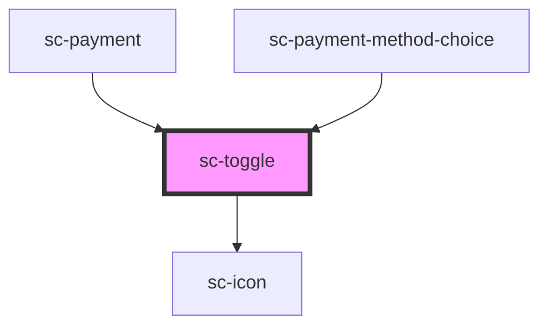

# sc-toggle

<!-- Auto Generated Below -->

## Properties

| Property      | Attribute      | Description                                                                                             | Type      | Default     |
| ------------- | -------------- | ------------------------------------------------------------------------------------------------------- | --------- | ----------- |
| `borderless`  | `borderless`   | Is this a borderless toggle?                                                                            | `boolean` | `false`     |
| `collapsible` | `collapsible`  | Are these collapsible?                                                                                  | `boolean` | `true`      |
| `disabled`    | `disabled`     | Disables the details so it can't be toggled.                                                            | `boolean` | `false`     |
| `open`        | `open`         | Indicates whether or not the details is open. You can use this in lieu of the show/hide methods.        | `boolean` | `false`     |
| `shady`       | `shady`        | Is this a shady                                                                                         | `boolean` | `false`     |
| `showControl` | `show-control` | Should we show a radio control?                                                                         | `boolean` | `false`     |
| `showIcon`    | `show-icon`    | Should we show the arrow icon?                                                                          | `boolean` | `true`      |
| `summary`     | `summary`      | The summary to show in the details header. If you need to display HTML, use the `summary` slot instead. | `string`  | `undefined` |

## Events

| Event    | Description     | Type                |
| -------- | --------------- | ------------------- |
| `scHide` | Show the toggle | `CustomEvent<void>` |
| `scShow` | Show the toggle | `CustomEvent<void>` |

## Shadow Parts

| Part             | Description |
| ---------------- | ----------- |
| `"base"`         |             |
| `"content"`      |             |
| `"header"`       |             |
| `"radio"`        |             |
| `"summary"`      |             |
| `"summary-icon"` |             |

## Dependencies

### Used by

 - [sc-payment](../../controllers/checkout-form/payment)
 - [sc-payment-method-choice](../../processors/sc-payment-method-choice)

### Depends on

- [sc-icon](../icon)

### Graph

----------------------------------------------

*Built with [StencilJS](https://stenciljs.com/)*
