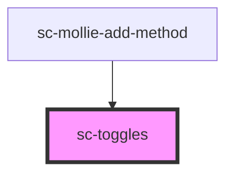

# sc-toggles

<!-- Auto Generated Below -->

## Properties

| Property      | Attribute     | Description                           | Type                       | Default     |
| ------------- | ------------- | ------------------------------------- | -------------------------- | ----------- |
| `accordion`   | `accordion`   | Should this function as an accordion? | `boolean`                  | `false`     |
| `collapsible` | `collapsible` | Are these collapsible?                | `boolean`                  | `true`      |
| `theme`       | `theme`       | Theme for the toggles                 | `"container" \| "default"` | `'default'` |

## Shadow Parts

| Part     | Description |
| -------- | ----------- |
| `"base"` |             |

## Dependencies

### Used by

 - [sc-mollie-add-method](../sc-mollie-add-method)

### Graph

----------------------------------------------

*Built with [StencilJS](https://stenciljs.com/)*
