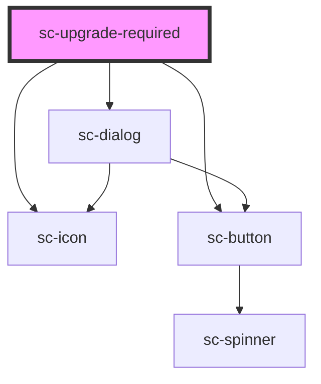

# sc-upgrade-required

<!-- Auto Generated Below -->

## Properties

| Property   | Attribute  | Description     | Type                             | Default   |
| ---------- | ---------- | --------------- | -------------------------------- | --------- |
| `required` | `required` |                 | `boolean`                        | `true`    |
| `size`     | `size`     | The tag's size. | `"large" \| "medium" \| "small"` | `'small'` |

## Dependencies

### Depends on

- [sc-dialog](../sc-dialog)
- [sc-icon](../icon)
- [sc-button](../button)

### Graph

----------------------------------------------

*Built with [StencilJS](https://stenciljs.com/)*
