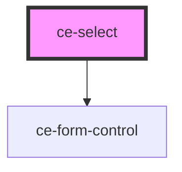

# ce-select

<!-- Auto Generated Below -->

## Properties

| Property                    | Attribute                  | Description                                                                                                                                                                                                                                        | Type                                                                                                                                                                                                                                                                                                                                                                                                                                                                                                                                                                          | Default               |
| --------------------------- | -------------------------- | -------------------------------------------------------------------------------------------------------------------------------------------------------------------------------------------------------------------------------------------------- | ----------------------------------------------------------------------------------------------------------------------------------------------------------------------------------------------------------------------------------------------------------------------------------------------------------------------------------------------------------------------------------------------------------------------------------------------------------------------------------------------------------------------------------------------------------------------------- | --------------------- |
| `addItemFilter`             | `add-item-filter`          | A RegExp or string (will be passed to RegExp constructor internally) or filter function that will need to return true for a user to successfully add an item.                                                                                      | `((value: string) => boolean) \| RegExp \| string`                                                                                                                                                                                                                                                                                                                                                                                                                                                                                                                            | `undefined`           |
| `addItemText`               | `add-item-text`            | The text that is shown when a user has inputted a new item but has not pressed the enter key. To access the current input value, pass a function with a value argument (see the default config for an example), otherwise pass a string.           | `((value: string) => string) \| string`                                                                                                                                                                                                                                                                                                                                                                                                                                                                                                                                       | `undefined`           |
| `addItems`                  | `add-items`                | Whether a user can add items.                                                                                                                                                                                                                      | `boolean`                                                                                                                                                                                                                                                                                                                                                                                                                                                                                                                                                                     | `undefined`           |
| `appendValue`               | `append-value`             | Append a value to each item added/selected.                                                                                                                                                                                                        | `string`                                                                                                                                                                                                                                                                                                                                                                                                                                                                                                                                                                      | `undefined`           |
| `callbackOnCreateTemplates` | --                         |                                                                                                                                                                                                                                                    | `(template: any) => any`                                                                                                                                                                                                                                                                                                                                                                                                                                                                                                                                                      | `undefined`           |
| `callbackOnInit`            | --                         |                                                                                                                                                                                                                                                    | `() => void`                                                                                                                                                                                                                                                                                                                                                                                                                                                                                                                                                                  | `undefined`           |
| `choices`                   | --                         | Add choices to select input.                                                                                                                                                                                                                       | `any[]`                                                                                                                                                                                                                                                                                                                                                                                                                                                                                                                                                                       | `[]`                  |
| `classNames`                | --                         | Classnames to use                                                                                                                                                                                                                                  | `{ containerOuter?: string; containerInner?: string; input?: string; inputCloned?: string; list?: string; listItems?: string; listSingle?: string; listDropdown?: string; item?: string; itemSelectable?: string; itemDisabled?: string; itemChoice?: string; placeholder?: string; group?: string; groupHeading?: string; button?: string; activeState?: string; focusState?: string; openState?: string; disabledState?: string; highlightedState?: string; selectedState: string; flippedState?: string; loadingState?: string; noResults?: string; noChoices?: string; }` | `undefined`           |
| `delimiter`                 | `delimiter`                | What divides each value. The default delimiter separates each value with a comma: "Value 1, Value 2, Value 3"                                                                                                                                      | `string`                                                                                                                                                                                                                                                                                                                                                                                                                                                                                                                                                                      | `','`                 |
| `duplicateItemsAllowed`     | `duplicate-items-allowed`  | Whether duplicate inputted/chosen items are allowed.                                                                                                                                                                                               | `boolean`                                                                                                                                                                                                                                                                                                                                                                                                                                                                                                                                                                     | `undefined`           |
| `editItems`                 | `edit-items`               | Whether a user can edit items. An item's value can be edited by pressing the backspace.                                                                                                                                                            | `boolean`                                                                                                                                                                                                                                                                                                                                                                                                                                                                                                                                                                     | `undefined`           |
| `fuseOptions`               | --                         | Fuse.js options                                                                                                                                                                                                                                    | `{ id?: string; caseSensitive?: boolean; includeMatches?: boolean; includeScore?: boolean; shouldSort?: boolean; keys?: string[] \| object[] \| WeightedField[]; verbose?: boolean; tokenize?: boolean; tokenSeparator?: RegExp; matchAllTokens?: boolean; location?: number; distance?: number; threshold?: number; maxPatternLength?: number; minMatchCharLength?: number; findAllMatches?: boolean; sortFn?(a: { score: number; }, b: { score: number; }): number; getFn?(obj: any, path: string): any; }`                                                                 | `undefined`           |
| `help`                      | `help`                     | The input's help text.                                                                                                                                                                                                                             | `string`                                                                                                                                                                                                                                                                                                                                                                                                                                                                                                                                                                      | `''`                  |
| `itemSelectText`            | `item-select-text`         | The text that is shown when a user hovers over a selectable choice.                                                                                                                                                                                | `string`                                                                                                                                                                                                                                                                                                                                                                                                                                                                                                                                                                      | `'Press to select'`   |
| `items`                     | --                         | Add pre-selected items to text input                                                                                                                                                                                                               | `any[]`                                                                                                                                                                                                                                                                                                                                                                                                                                                                                                                                                                       | `[]`                  |
| `label`                     | `label`                    | The input's label.                                                                                                                                                                                                                                 | `string`                                                                                                                                                                                                                                                                                                                                                                                                                                                                                                                                                                      | `undefined`           |
| `loadingText`               | `loading-text`             | The text that is shown whilst choices are being populated via AJAX.                                                                                                                                                                                | `string`                                                                                                                                                                                                                                                                                                                                                                                                                                                                                                                                                                      | `'Loading...'`        |
| `maxItemCount`              | `max-item-count`           | The amount of items a user can input/select ("-1" indicates no limit).                                                                                                                                                                             | `number`                                                                                                                                                                                                                                                                                                                                                                                                                                                                                                                                                                      | `undefined`           |
| `maxItemText`               | `max-item-text`            | The text that is shown when a user has focus on the input but has already reached the max item count. To access the max item count, pass a function with a maxItemCount argument (see the default config for an example), otherwise pass a string. | `((maxItemCount: number) => string) \| string`                                                                                                                                                                                                                                                                                                                                                                                                                                                                                                                                | `undefined`           |
| `name`                      | `name`                     | The input's name attribute.                                                                                                                                                                                                                        | `string`                                                                                                                                                                                                                                                                                                                                                                                                                                                                                                                                                                      | `undefined`           |
| `noChoicesText`             | `no-choices-text`          | The text that is shown when a user has selected all possible choices. Optionally pass a function returning a string.                                                                                                                               | `(() => string) \| string`                                                                                                                                                                                                                                                                                                                                                                                                                                                                                                                                                    | `'No choices found.'` |
| `noResultsText`             | `no-results-text`          | The text that is shown when a user's search has returned no results. Optionally pass a function returning a string.                                                                                                                                | `(() => string) \| string`                                                                                                                                                                                                                                                                                                                                                                                                                                                                                                                                                    | `'No results found.'` |
| `paste`                     | `paste`                    | Whether a user can paste into the input.                                                                                                                                                                                                           | `boolean`                                                                                                                                                                                                                                                                                                                                                                                                                                                                                                                                                                     | `true`                |
| `pill`                      | `pill`                     | Draws a pill-style input with rounded edges.                                                                                                                                                                                                       | `boolean`                                                                                                                                                                                                                                                                                                                                                                                                                                                                                                                                                                     | `false`               |
| `placeholder`               | `placeholder`              | Whether the input should show a placeholder. Used in conjunction with placeholderValue. If placeholder is set to true and no value is passed to placeholderValue, the passed input's placeholder attribute will be used as the placeholder value.  | `boolean \| string`                                                                                                                                                                                                                                                                                                                                                                                                                                                                                                                                                           | `undefined`           |
| `placeholderValue`          | `placeholder-value`        | The value of the inputs placeholder.                                                                                                                                                                                                               | `string`                                                                                                                                                                                                                                                                                                                                                                                                                                                                                                                                                                      | `undefined`           |
| `position`                  | `position`                 | Whether the dropdown should appear above (top) or below (bottom) the input. By default, if there is not enough space within the window the dropdown will appear above the input, otherwise below it.                                               | `"auto" \| "bottom" \| "top"`                                                                                                                                                                                                                                                                                                                                                                                                                                                                                                                                                 | `undefined`           |
| `prependValue`              | `prepend-value`            | Prepend a value to each item added/selected.                                                                                                                                                                                                       | `string`                                                                                                                                                                                                                                                                                                                                                                                                                                                                                                                                                                      | `undefined`           |
| `removeItemButton`          | `remove-item-button`       | Whether each item should have a remove button.                                                                                                                                                                                                     | `boolean`                                                                                                                                                                                                                                                                                                                                                                                                                                                                                                                                                                     | `undefined`           |
| `removeItems`               | `remove-items`             | Whether a user can remove items.                                                                                                                                                                                                                   | `boolean`                                                                                                                                                                                                                                                                                                                                                                                                                                                                                                                                                                     | `undefined`           |
| `renderChoiceLimit`         | `render-choice-limit`      | A The amount of choices to be rendered within the dropdown list ("-1" indicates no limit). This is useful if you have a lot of choices where it is easier for a user to use the search area to find a choice.                                      | `number`                                                                                                                                                                                                                                                                                                                                                                                                                                                                                                                                                                      | `-1`                  |
| `renderSelectedChoices`     | `render-selected-choices`  | Whether selected choices should be removed from the list. By default choices are removed when they are selected in multiple select box. To always render choices pass always.                                                                      | `"always" \| "auto"`                                                                                                                                                                                                                                                                                                                                                                                                                                                                                                                                                          | `'auto'`              |
| `resetScrollPosition`       | `reset-scroll-position`    | Whether the scroll position should reset after adding an item.                                                                                                                                                                                     | `boolean`                                                                                                                                                                                                                                                                                                                                                                                                                                                                                                                                                                     | `undefined`           |
| `searchChoices`             | `search-choices`           | Whether choices should be filtered by input or not. If false, the search event will still emit, but choices will not be filtered.                                                                                                                  | `boolean`                                                                                                                                                                                                                                                                                                                                                                                                                                                                                                                                                                     | `true`                |
| `searchEnabled`             | `search-enabled`           | Whether a search area should be shown. Note: Multiple select boxes will always show search areas.                                                                                                                                                  | `boolean`                                                                                                                                                                                                                                                                                                                                                                                                                                                                                                                                                                     | `true`                |
| `searchFields`              | `search-fields`            | Specify which fields should be used when a user is searching. If you have added custom properties to your choices, you can add these values thus: ['label', 'value', 'customProperties.example'].                                                  | `string \| string[]`                                                                                                                                                                                                                                                                                                                                                                                                                                                                                                                                                          | `undefined`           |
| `searchFloor`               | `search-floor`             | The minimum length a search value should be before choices are searched.                                                                                                                                                                           | `number`                                                                                                                                                                                                                                                                                                                                                                                                                                                                                                                                                                      | `undefined`           |
| `searchPlaceholderValue`    | `search-placeholder-value` | The value of the search inputs placeholder.                                                                                                                                                                                                        | `string`                                                                                                                                                                                                                                                                                                                                                                                                                                                                                                                                                                      | `undefined`           |
| `searchResultLimit`         | `search-result-limit`      | The maximum amount of search results to show.                                                                                                                                                                                                      | `number`                                                                                                                                                                                                                                                                                                                                                                                                                                                                                                                                                                      | `undefined`           |
| `shouldSort`                | `should-sort`              | A RegExp or string (will be passed to RegExp constructor internally) or filter function that will need to return true for a user to successfully add an item.                                                                                      | `boolean`                                                                                                                                                                                                                                                                                                                                                                                                                                                                                                                                                                     | `undefined`           |
| `shouldSortItems`           | `should-sort-items`        | Whether choices and groups should be sorted. If false, choices/groups will appear in the order they were given.                                                                                                                                    | `boolean`                                                                                                                                                                                                                                                                                                                                                                                                                                                                                                                                                                     | `undefined`           |
| `showLabel`                 | `show-label`               | Should we show the label                                                                                                                                                                                                                           | `boolean`                                                                                                                                                                                                                                                                                                                                                                                                                                                                                                                                                                     | `true`                |
| `silent`                    | `silent`                   | Optionally suppress console errors and warnings.                                                                                                                                                                                                   | `boolean`                                                                                                                                                                                                                                                                                                                                                                                                                                                                                                                                                                     | `false`               |
| `size`                      | `size`                     | The input's size.                                                                                                                                                                                                                                  | `"large" \| "medium" \| "small"`                                                                                                                                                                                                                                                                                                                                                                                                                                                                                                                                              | `'medium'`            |
| `sorter`                    | --                         | The function that will sort choices and items before they are displayed (unless a user is searching). By default choices and items are sorted by alphabetical order.                                                                               | `(el1: any, el2: any) => number`                                                                                                                                                                                                                                                                                                                                                                                                                                                                                                                                              | `undefined`           |
| `type`                      | `type`                     | The type of input                                                                                                                                                                                                                                  | `"multiple" \| "single" \| "text"`                                                                                                                                                                                                                                                                                                                                                                                                                                                                                                                                            | `'single'`            |
| `value`                     | `value`                    | The input's value attribute.                                                                                                                                                                                                                       | `string`                                                                                                                                                                                                                                                                                                                                                                                                                                                                                                                                                                      | `''`                  |
| `valueComparer`             | --                         |                                                                                                                                                                                                                                                    | `(value1: string, value2: string) => boolean`                                                                                                                                                                                                                                                                                                                                                                                                                                                                                                                                 | `undefined`           |

## Methods

### `ajax(fn: AjaxFn) => Promise<this>`

#### Returns

Type: `Promise<this>`

### `clearChoices() => Promise<this>`

#### Returns

Type: `Promise<this>`

### `clearInput() => Promise<this>`

#### Returns

Type: `Promise<this>`

### `clearStore() => Promise<this>`

#### Returns

Type: `Promise<this>`

### `disable() => Promise<this>`

#### Returns

Type: `Promise<this>`

### `enable() => Promise<this>`

#### Returns

Type: `Promise<this>`

### `getValue(valueOnly?: boolean) => Promise<string | Array<string>>`

#### Returns

Type: `Promise<string | string[]>`

### `hideDropdown(blurInput?: boolean) => Promise<this>`

#### Returns

Type: `Promise<this>`

### `highlightAll() => Promise<this>`

#### Returns

Type: `Promise<this>`

### `highlightItem(item: HTMLElement, runEvent?: boolean) => Promise<this>`

#### Returns

Type: `Promise<this>`

### `removeActiveItems(excludedId?: number) => Promise<this>`

#### Returns

Type: `Promise<this>`

### `removeActiveItemsByValue(value: string) => Promise<this>`

#### Returns

Type: `Promise<this>`

### `removeHighlightedItems(runEvent?: boolean) => Promise<this>`

#### Returns

Type: `Promise<this>`

### `setChoiceByValue(value: string | Array<string>) => Promise<this>`

#### Returns

Type: `Promise<this>`

### `setChoices(choices: Array<any>, value: string, label: string, replaceChoices?: boolean) => Promise<this>`

#### Returns

Type: `Promise<this>`

### `setValue(args: Array<any>) => Promise<this>`

#### Returns

Type: `Promise<this>`

### `showDropdown(focusInput?: boolean) => Promise<this>`

#### Returns

Type: `Promise<this>`

### `unhighlightAll() => Promise<this>`

#### Returns

Type: `Promise<this>`

### `unhighlightItem(item: HTMLElement) => Promise<this>`

#### Returns

Type: `Promise<this>`

## Dependencies

### Depends on

- [ce-form-control](../form-control)

### Graph

----------------------------------------------

*Built with [StencilJS](https://stenciljs.com/)*
