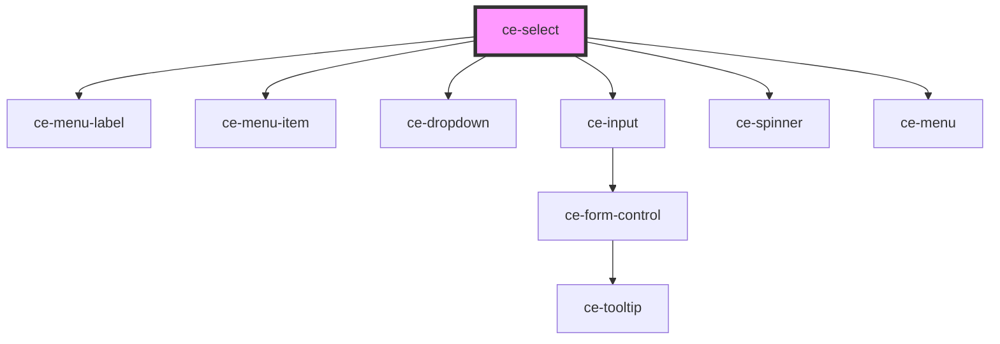

# ce-select-dropdown

<!-- Auto Generated Below -->

## Properties

| Property            | Attribute            | Description                                                                                                                                                                                                   | Type                              | Default          |
| ------------------- | -------------------- | ------------------------------------------------------------------------------------------------------------------------------------------------------------------------------------------------------------- | --------------------------------- | ---------------- |
| `choices`           | --                   | The input's value attribute.                                                                                                                                                                                  | `ChoiceItem[]`                    | `[]`             |
| `invalid`           | `invalid`            | This will be true when the control is in an invalid state. Validity is determined by props such as `type`, `required`, `minlength`, `maxlength`, and `pattern` using the browser's constraint validation API. | `boolean`                         | `false`          |
| `loading`           | `loading`            |                                                                                                                                                                                                               | `boolean`                         | `undefined`      |
| `open`              | `open`               | Is this open                                                                                                                                                                                                  | `boolean`                         | `undefined`      |
| `placeholder`       | `placeholder`        | Placeholder for no value                                                                                                                                                                                      | `string`                          | `''`             |
| `position`          | `position`           |                                                                                                                                                                                                               | `"bottom-left" \| "bottom-right"` | `'bottom-right'` |
| `required`          | `required`           |                                                                                                                                                                                                               | `boolean`                         | `undefined`      |
| `search`            | `search`             | Is search enabled?                                                                                                                                                                                            | `boolean`                         | `undefined`      |
| `searchPlaceholder` | `search-placeholder` | Placeholder for search                                                                                                                                                                                        | `string`                          | `''`             |
| `value`             | `value`              | The input's value attribute.                                                                                                                                                                                  | `string`                          | `''`             |

## Events

| Event      | Description                                       | Type                  |
| ---------- | ------------------------------------------------- | --------------------- |
| `ceChange` | Emitted when the control's value changes.         | `CustomEvent<void>`   |
| `ceClose`  | Emitted whent the components search query changes | `CustomEvent<string>` |
| `ceOpen`   | Emitted whent the components search query changes | `CustomEvent<string>` |
| `ceSearch` | Emitted whent the components search query changes | `CustomEvent<string>` |

## Methods

### `reportValidity() => Promise<boolean>`

#### Returns

Type: `Promise<boolean>`

### `setCustomValidity(message: string) => Promise<void>`

Sets a custom validation message. If `message` is not empty, the field will be considered invalid.

#### Returns

Type: `Promise<void>`

## Shadow Parts

| Part       | Description |
| ---------- | ----------- |
| `"caret"`  |             |
| `"search"` |             |

## Dependencies

### Depends on

- [ce-menu-label](../menu-label)
- [ce-menu-item](../menu-item)
- [ce-dropdown](../dropdown)
- [ce-input](../input)
- [ce-spinner](../spinner)
- [ce-menu](../menu)

### Graph

----------------------------------------------

*Built with [StencilJS](https://stenciljs.com/)*
