# ce-skeleton

<!-- Auto Generated Below -->

## Properties

| Property | Attribute | Description      | Type                           | Default   |
| -------- | --------- | ---------------- | ------------------------------ | --------- |
| `effect` | `effect`  | Animation effect | `"none" \| "pulse" \| "sheen"` | `'sheen'` |

## Shadow Parts

| Part          | Description |
| ------------- | ----------- |
| `"base"`      |             |
| `"indicator"` |             |

## Dependencies

### Used by

 - [sc-charges-list](../../controllers/dashboard/charges-list)
 - [sc-coupon-form](../coupon-form)
 - [sc-customer-details](../customer-details)
 - [sc-donation-choices](../../controllers/checkout-form/sc-donation-choices)
 - [sc-downloads-list](../downloads-list)
 - [sc-invoices-list](../../controllers/dashboard/invoices-list)
 - [sc-line-item-total](../../controllers/checkout-form/line-item-total)
 - [sc-line-items](../../controllers/checkout-form/line-items)
 - [sc-order-confirmation-line-items](../../controllers/confirmation/order-confirmation-line-items)
 - [sc-order-detail](../../controllers/confirmation/order-detail)
 - [sc-order-summary](../../controllers/checkout-form/order-summary)
 - [sc-orders-list](../../controllers/dashboard/orders-list)
 - [sc-payment](../../controllers/checkout-form/payment)
 - [sc-payment-methods-list](../../controllers/dashboard/payment-methods-list)
 - [sc-price-choice](../../controllers/checkout-form/price-choice)
 - [sc-subscription](../../controllers/dashboard/subscription)
 - [sc-subscription-cancel](../../controllers/dashboard/subscription-cancel)
 - [sc-subscription-details](../../controllers/dashboard/subscription-details)
 - [sc-subscription-payment](../../controllers/dashboard/subscription-payment)
 - [sc-subscription-renew](../../controllers/dashboard/subscription-renew)
 - [sc-subscription-switch](../../controllers/dashboard/subscription-switch)
 - [sc-subscriptions-list](../../controllers/dashboard/subscriptions-list)
 - [sc-upcoming-invoice](../../controllers/dashboard/upcoming-invoice)

### Graph

```mermaid
graph TD;
  sc-charges-list --> sc-skeleton
  sc-coupon-form --> sc-skeleton
  sc-customer-details --> sc-skeleton
  sc-donation-choices --> sc-skeleton
  sc-downloads-list --> sc-skeleton
  sc-invoices-list --> sc-skeleton
  sc-line-item-total --> sc-skeleton
  sc-line-items --> sc-skeleton
  sc-order-confirmation-line-items --> sc-skeleton
  sc-order-detail --> sc-skeleton
  sc-order-summary --> sc-skeleton
  sc-orders-list --> sc-skeleton
  sc-payment --> sc-skeleton
  sc-payment-methods-list --> sc-skeleton
  sc-price-choice --> sc-skeleton
  sc-subscription --> sc-skeleton
  sc-subscription-cancel --> sc-skeleton
  sc-subscription-details --> sc-skeleton
  sc-subscription-payment --> sc-skeleton
  sc-subscription-renew --> sc-skeleton
  sc-subscription-switch --> sc-skeleton
  sc-subscriptions-list --> sc-skeleton
  sc-upcoming-invoice --> sc-skeleton
  style sc-skeleton fill:#f9f,stroke:#333,stroke-width:4px
```

----------------------------------------------

*Built with [StencilJS](https://stenciljs.com/)*
